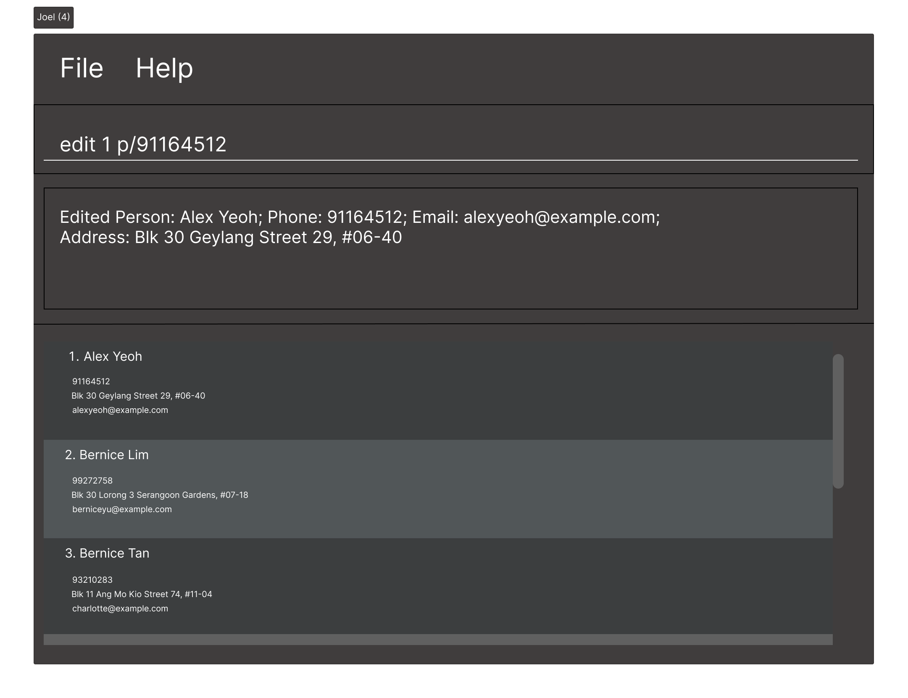

# MODCheck
MODCheck is a contact management app that enables you to manage all your contacts easily that works on Windows, MacOS and Linux!
Our app is catered towards fast typist and many features are catered for students that need better management of their contacts.

## Main GUI

<em>Main UI</em>

## Key Features

### 🔍 Filter contacts by their tags quickly

MODCheck can quickly filter all your contacts based on the tag provided

### 💾 Instant saving when changes are made

MODCheck can save all your work immediately on the fly

### ✅ List all contacts quickly without lag

MODCheck can display all your contacts in one go!

## Usage

**:information_source: Notes about the command format:** 

* Words in `UPPER_CASE` are the parameters to be supplied by the user. 
  e.g. in `add n/NAME`, `NAME` is a parameter which can be used as `add n/John Doe`.

* Items in square brackets are optional. 
  e.g `n/NAME [t/TAG]` can be used as `n/John Doe t/friend` or as `n/John Doe`.

* Items with `…`​ after them can be used multiple times including zero times. 
  e.g. `[t/TAG]…​` can be used as ` ` (i.e. 0 times), `t/friend`, `t/friend t/family` etc.

* Parameters can be in any order. 
  e.g. if the command specifies `n/NAME p/PHONE_NUMBER`, `p/PHONE_NUMBER n/NAME` is also acceptable.

* If a parameter is expected only once in the command but you specified it multiple times, only the last occurrence of the parameter will be taken. 
  e.g. if you specify `p/12341234 p/56785678`, only `p/56785678` will be taken.

* Extraneous parameters for commands that do not take in parameters (such as `help`, `list`, `exit` and `clear`) will be ignored. 
  e.g. if the command specifies `help 123`, it will be interpreted as `help`.

### Viewing help : `help`

Shows a message explaning how to access the help page.

Format: `help`

### Adding a person: `add`

Adds a person to the address book.

Format: `add n/NAME p/PHONE_NUMBER e/EMAIL a/ADDRESS [t/TAG]…​`

:bulb: **Tip:**
A person can have any number of tags (including 0)

Examples:
* `add n/John Doe p/98765432 e/johnd@example.com a/John street, block 123, #01-01`
* `add n/Betsy Crowe t/friend e/betsycrowe@example.com a/Newgate Prison p/1234567 t/criminal`

### Listing all persons : `list`

Shows a list of all persons in the address book.

Format: `list`

### Editing a person : `edit`

Edits an existing person in ModCheck.

Format: `edit INDEX [n/NAME] [p/PHONE] [e/EMAIL] [a/ADDRESS] [t/TAG]…​`

* Edits the person at the specified `INDEX`. The index refers to the index number shown in the displayed person list. The index **must be a positive integer** 1, 2, 3, …​
* At least one of the optional fields must be provided.
* Existing values will be updated to the input values.
* When editing tags, the existing tags of the person will be removed i.e adding of tags is not cumulative.
* You can remove all the person’s tags by typing `t/` without
  specifying any tags after it.

Examples:
*  `edit 1 p/91164512` Edits the phone number of the 1st person to be `91164512`.
*  `edit 3 p/90011009 e/bernice512@example.com` Edits the phone number and email address of the 3rd person to be
   90011009 and bernice512@example.com respectively
   

### Locating persons by name: `find`

Finds persons whose names contain any of the given keywords.

Format: `find KEYWORD [MORE_KEYWORDS]`

* The search is case-insensitive. e.g `hans` will match `Hans`
* The order of the keywords does not matter. e.g. `Hans Bo` will match `Bo Hans`
* Only the name is searched.
* Only full words will be matched e.g. `Han` will not match `Hans`
* Persons matching at least one keyword will be returned (i.e. `OR` search).
  e.g. `Hans Bo` will return `Hans Gruber`, `Bo Yang`

Examples:
* `find John` returns `john` and `John Doe`
* `find alex david` returns `Alex Yeoh`, `David Li` 

<em>result for 'find alex david'</em>

### Deleting a person : `delete`

Deletes the specified person from the address book.

Format: `delete INDEX`

* Deletes the person at the specified `INDEX`.
* The index refers to the index number shown in the displayed person list.
* The index **must be a positive integer** 1, 2, 3, …​

Examples:
* `list` followed by `delete 2` deletes the 2nd person in the address book.
* `find Betsy` followed by `delete 1` deletes the 1st person in the results of the `find` command.

### Clearing all entries : `clear`

Clears all entries from the address book.

Format: `clear`

### Exiting the program : `exit`

Exits the program.

Format: `exit`

### Saving the data

AddressBook data are saved in the hard disk automatically after any command that changes the data. There is no need to save manually.

### Editing the data file

AddressBook data are saved as a JSON file `[JAR file location]/data/addressbook.json`. Advanced users are welcome to update data directly by editing that data file.

:exclamation: **Caution:**
If your changes to the data file makes its format invalid, AddressBook will discard all data and start with an empty data file at the next run.

### Filter contacts by tags

Given the tag, find all contacts that has the specified tag

Format: `filter [TAG]`

Examples:
- `filter Family`
- `filter Friends`

### Undo past commands
Undoes previous commands that modified ModCheck.
Undo will only undo commands that have successfully modified the data in ModCheck. For example, a successful `add`, 
`edit`, or `delete` command can be undone by the undo command.
Any commands that does not modify the data in ModCheck will NOT be undone. This includes `view`, `find`, and other 
similar commands. Any command that would have modified the data in ModCheck, but was unsuccessful in doing so (eg: 
`add` duplicate person), will NOT be undone.

Chaining of a few undo commands is supported. Once the undo limit has been reached, the error message `No command to 
undo!` will be shown.

Format: `undo`

Use `redo` to reapply the changes undone by undo.

## Command Summary

| Action     | Format, Examples                                                                                                                                                      |
|------------|-----------------------------------------------------------------------------------------------------------------------------------------------------------------------|
| **Add**    | `add n/NAME p/PHONE_NUMBER e/EMAIL a/ADDRESS [t/TAG]…​`   e.g., `add n/James Ho p/22224444 e/jamesho@example.com a/123, Clementi Rd, 1234665 t/friend t/colleague` |
| **Clear**  | `clear`                                                                                                                                                               |
| **Delete** | `delete INDEX`  e.g., `delete 3`                                                                                                                                   |
| **Edit**   | `edit INDEX [n/NAME] [p/PHONE_NUMBER] [e/EMAIL] [a/ADDRESS] [t/TAG]…​`  e.g.,`edit 2 n/James Lee e/jameslee@example.com`                                           |
| **Find**   | `find KEYWORD [MORE_KEYWORDS]`  e.g., `find James Jake`                                                                                                            |
| **List**   | `list`                                                                                                                                                                |
| **Help**   | `help`                                                                                                                                                                |
| **Filter** | `filter [TAG]`   e.g., `filter Girlfriend`, `filter family`                                                                                                        |
| **Undo**   | `undo`                                                                                                                                                                |
| **Redo**   | `redo`                                                                                                                                                                |

---
