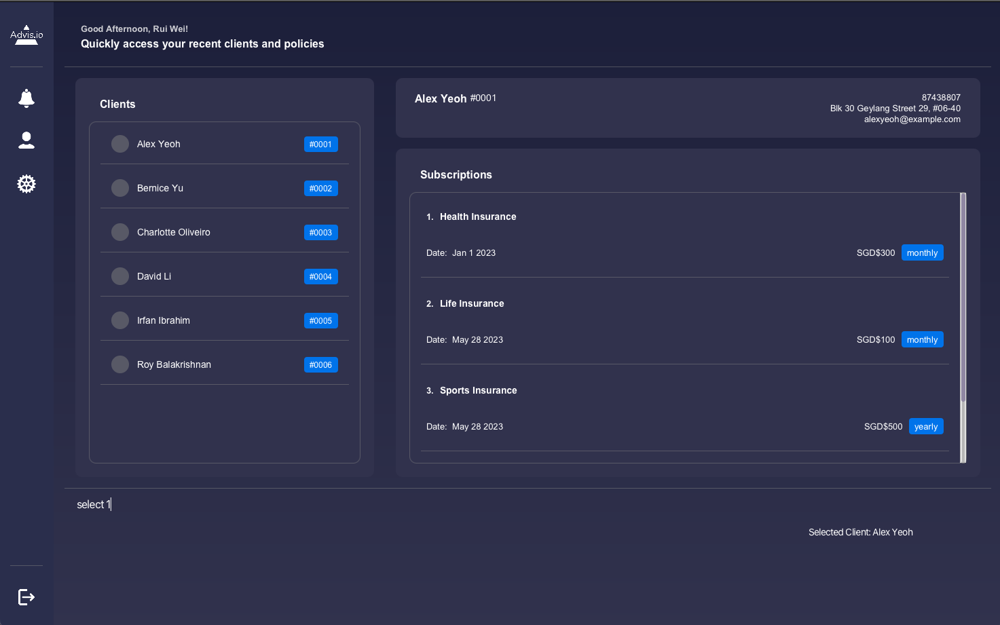

* The project simulates an ongoing software project for a desktop application (called _Advisio_) used by financial
  advisors to manage their clients' financial portfolio.
    * This application follows the **OOP Paradigm**.
    * It comes with a **reasonable level of user and developer documentation**.
    * It provides the necessary resources for financial advisors to keep track of their clients.
    * This application is optimal for users who are able to type fast.
* It is named `Advisio` (`AVO` for short).
* For the detailed documentation of this project, see the **[Advisio Product Website](https://ay2223s2-cs2103t-t09-4.github.io/tp/)**.
* This project is based on the AddressBook-Level3 project created by the [SE-EDU initiative](https://se-education.org).
