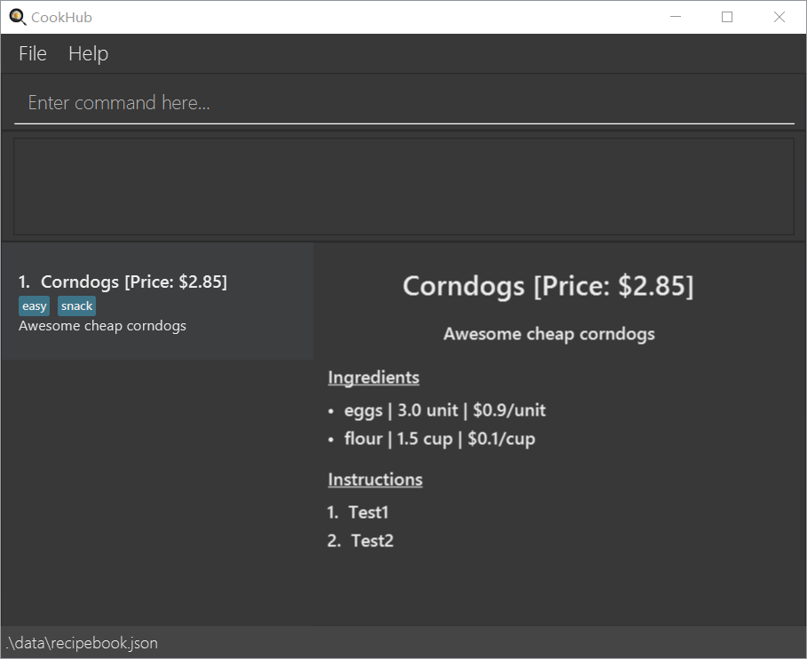

* This is our **TP for Software Engineering (SE) students CS2103T W07**. 

* It is named `CookHub` and this is project intends to be a digital version of a cookbook for student chefs to store and refer to when searching up for recipes to cook.
* Student will be able to store his/her recipe, and view them as shown in the Ui Mockup.
* Student will be able to see steps, as well as the ingredients.
* Student will be able to delete their recipes.

* This project is based on the AddressBook-Level3 project created by the [SE-EDU initiative](https://se-education.org).

