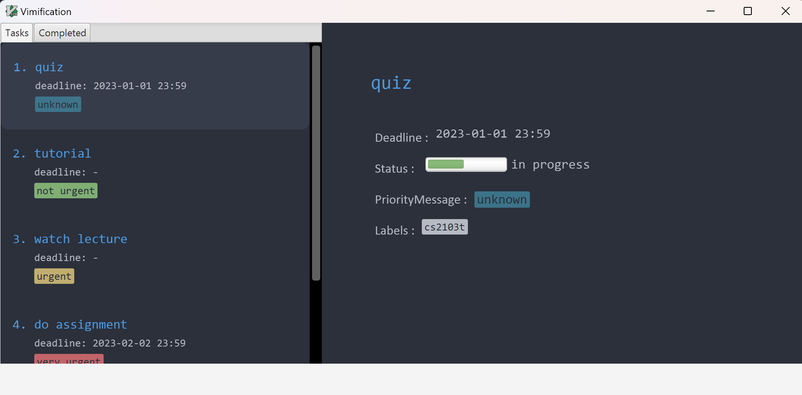

* This is **a desktop application for managing bookmarks**. 
  Example usages:
  * To keep track of a book your are currently reading.
  * To keep track of books you have finished reading.
  * To keep track of books you wish to start reading.
* For the detailed documentation of this project, see the **[MyLib Product Website](https://ay2223s2-cs2103t-t13-4.github.io/tp/)**.
* This project is based on the AddressBook-Level3 project created by the [SE-EDU initiative](https://se-education.org).
