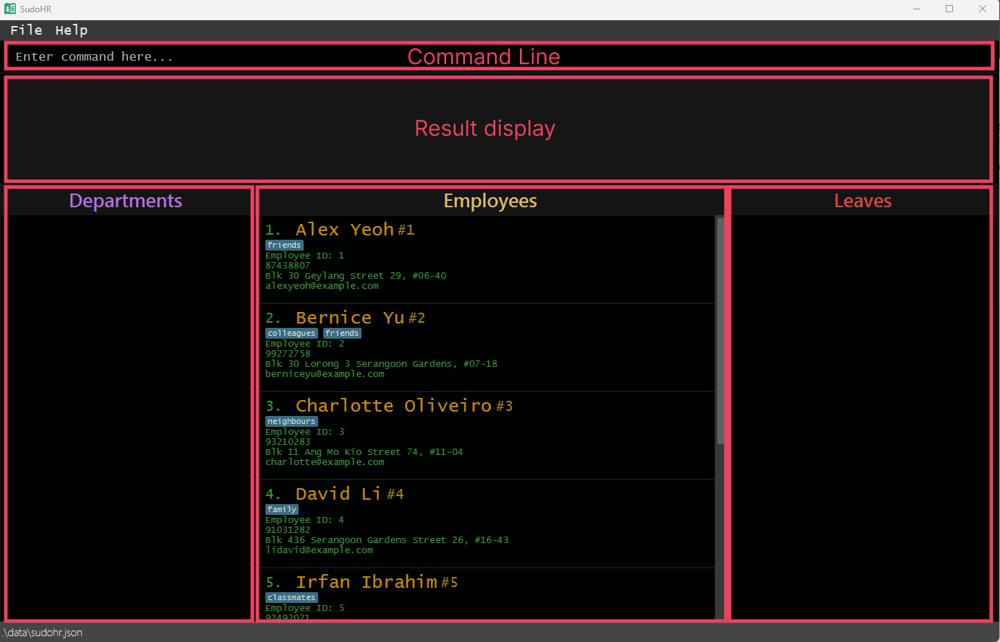

### SudoHR ###

&nbsp;
&nbsp;

* This is **a tool for HR to consolidate data about employees**. 
  Example usages:
  * update data about employees phone number, department, etc.
  * list all employees in a department.
* The project builds upon an ongoing software project for a desktop application (called _AddressBook_) used for managing contact details.
  * It is **written in OOP fashion**. It provides a **reasonably well-written** code base **bigger** (around 6 KLoC) than what students usually write in beginner-level SE modules, without being overwhelmingly big.
  * It comes with a **reasonable level of user and developer documentation**.
