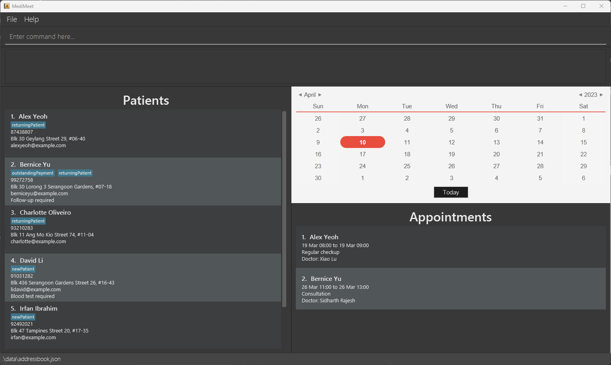

# MediMeet

## Overview

**MediMeet** is a patient appointment management system for individual medical practitioners and small clinics.
With MediMeet, you can efficiently manage patient and appointment information in one place,
saving you both time and the hassle of maintaining records across multiple systems.  

MediMeet is a command-line interface (CLI) application with fast, easy-to-use commands which make it ideal for the
fast typist.
With MediMeet, we make it easy to add and edit patient information, appointments and so much more, making it
a one-stop solution to manage your individual medical practice or small clinic!  

**MediMeet** is:
* written in Java, in OOP fashion
* documented for both users and developers
* optimised for CLI

## Features
1. Patient list
2. Appointment manager
3. Calendar view of appointments
4. Upcoming appointments at a glance

# Acknowledgements
This project is based on the AddressBook-Level3 project created by the [SE-EDU initiative](https://se-education.org).
