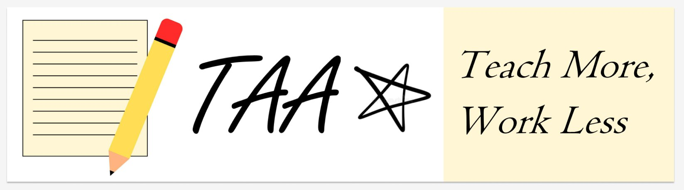

# Teaching Assistant Assistant

Teaching Assistant Assistant (TAA) is a desktop app for managing teaching assistant activities, optimized for use via a Command Line Interface (CLI) while still having the benefits of a Graphical User Interface (GUI). If you can type fast, TAA can get your teaching assistant tasks done faster than traditional GUI apps.

This project is based on the AddressBook-Level3 project created by the [SE-EDU initiative](https://se-education.org).

## Acknowledgements

This project uses [Apache Commons CSV](https://commons.apache.org/proper/commons-csv/) under [Apache License 2.0](https://www.apache.org/licenses/LICENSE-2.0) and [JFreeChart](https://www.jfree.org/jfreechart/) under the [GNU Lesser General Public License](https://www.gnu.org/licenses/lgpl-3.0.html).
