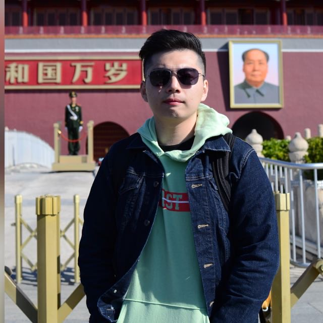
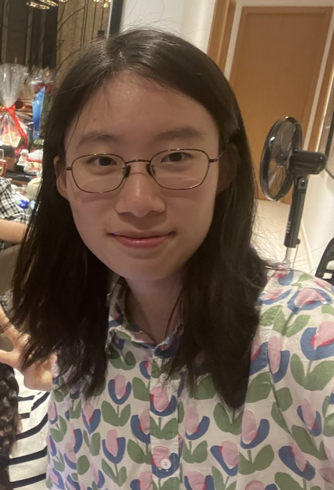
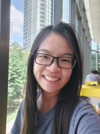

We are a team based in the [School of Computing, National University of Singapore](http://www.comp.nus.edu.sg).

You can reach us at the email `seer[at]comp.nus.edu.sg`

## Project team

### Wang ShaoFeng

[[github](https://github.com/sfcoding123)]
[[portfolio](team/johndoe.md)]

* Role: Team Lead
* Responsibilities: Project Management and Testing

### Wei De

[[github](https://github.com/WeideTeo)]
[[portfolio](https://www.linkedin.com/in/weideteo/)]

* Role: Developer
* Responsibilities: Add Functions

### Luo Xizi

[[github](https://github.com/lxz333)] [[portfolio](team/johndoe.md)]

* Role: Developer
* Responsibilities: Data

### Shen Chenzi

[[github](https://github.com/shenchenzizoe)]
[[portfolio](team/johndoe.md)]

* Year 2 NUS Computer Science Student
* Sleep >= 12 hours per day

### Xiao Yan

[[github](http://github.com/windycall)]
[[portfolio](team/johndoe.md)]

* Role: Developer
* Responsibilities: Storage, Backend
