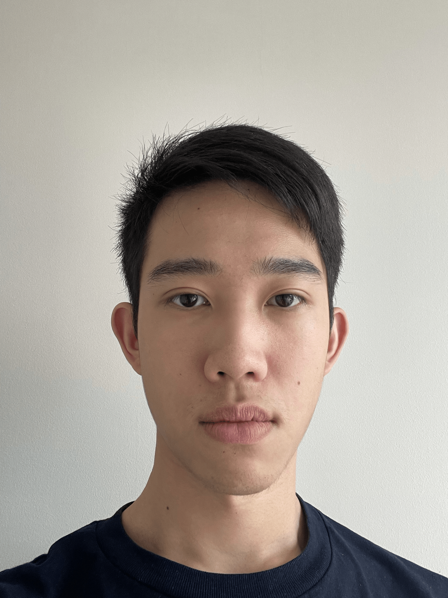
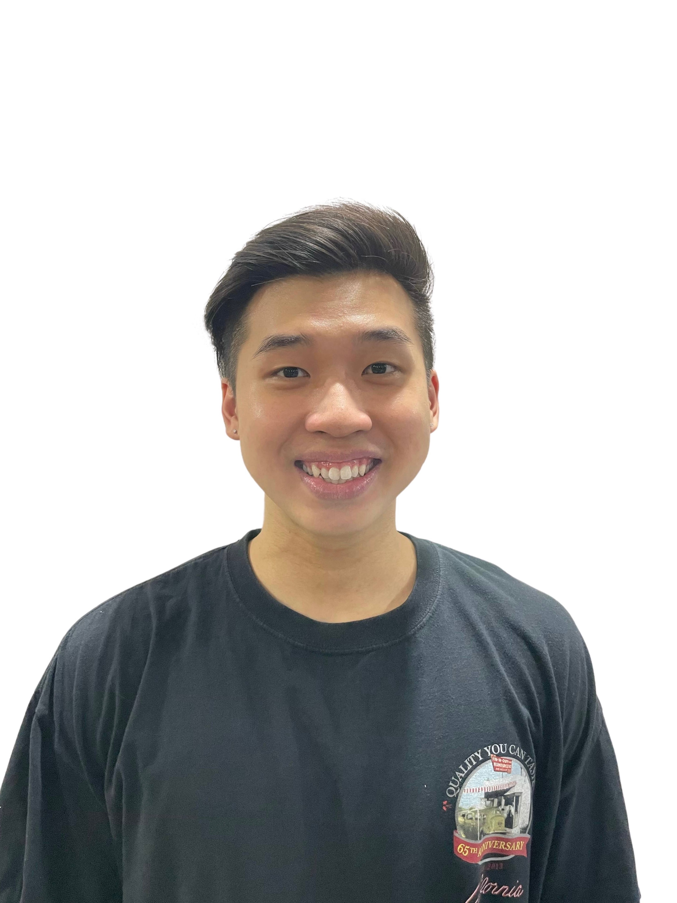

We are a team based in the [School of Computing, National University of Singapore](http://www.comp.nus.edu.sg).

You can reach us at the email `seer[at]comp.nus.edu.sg`

## Project team

### Lin Chieh

[[github](https://github.com/euph00)][[portfolio](team/euph00.md)]

* Role: Team member
* Responsibilities: In charge of implementation of backend Model components.

### Zheng Ze

[[github](http://github.com/pzhengze)]
[[portfolio](team/pzhengze.md)]

* Role: Team member
* Responsibilities: ??

### Lucas

[[github](http://github.com/lukkesreysandeur)]
[[portfolio](team/lukkesreysandeur.md)]

* Role: Team member
* Responsibilities: ??

### Glenn Ong JunJie

[[github](https://github.com/GlennOngJunJie)]
[[portfolio](team/glennongjunjie.md)]

* Role: Team Member
* Responsibilities: ??

### Shin Jin

[[github](http://github.com/jinnieshin)]
[[portfolio](team/jinnieshin.md)]

* Role: Team member
* Responsibilities: ??
