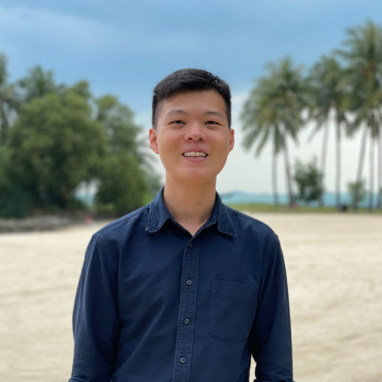
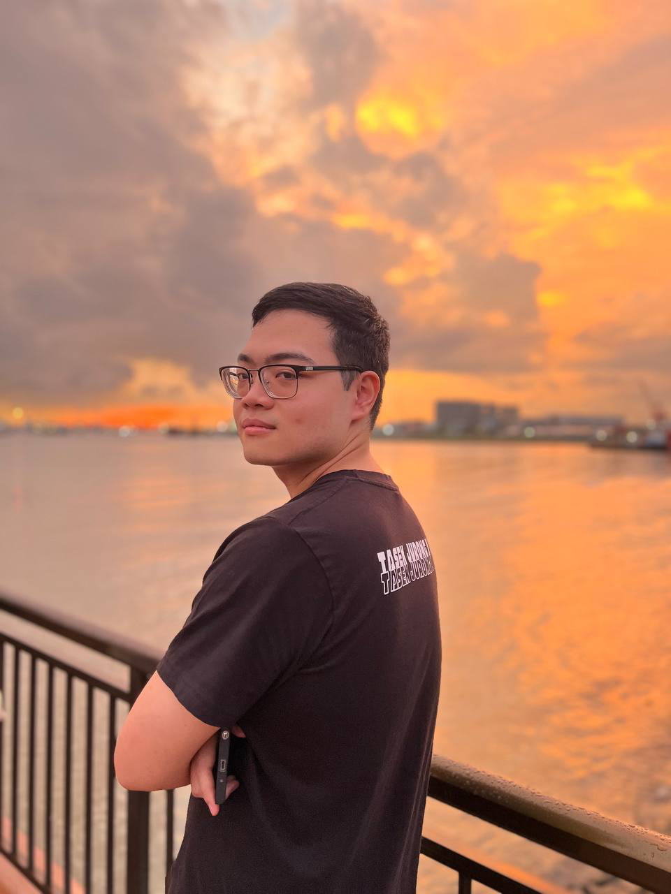
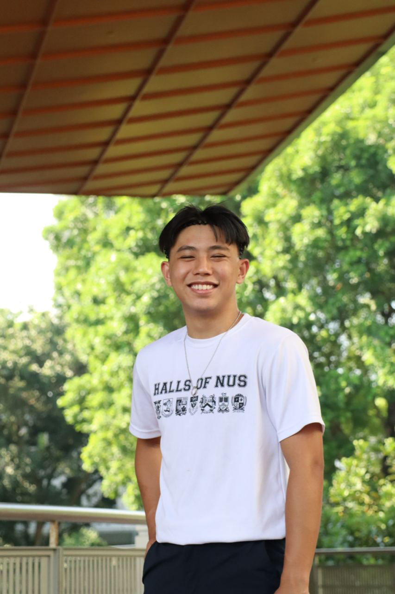

We are a team based in the [School of Computing, National University of Singapore](http://www.comp.nus.edu.sg).

You can reach us at the email `seer[at]comp.nus.edu.sg`

## Project team

### Merrick Neo

[[github](http://github.com/merrickneo)][[portfolio](team/merrickneo.md)]

* Role: Developer
* Responsibilities: Documentation, Testing

### Frederic Chow

[[github](http://github.com/fredericchow00)][[portfolio](team/fredericchow00.md)]

* Role: Developer
* Responsibilities: Data, Deliverables and Deadline

### Bo Feng

[[github](http://github.com/bofeng1999)][[portfolio](team/bofeng1999.md)]

* Role: Developer
* Responsibilities: Dev Ops + Threading

### Jia Xin

[[github](http://github.com/jxleejiaxin)][[portfolio](team/jxleejiaxin.md)]

* Role: Developer
* Responsibilities: Code Quality + Testing

### Dun Liang

[[github](http://github.com/dunliang0513)][[portfolio](team/dunliang0513.md)]

* Role: Developer
* Responsibilities: Integration, Documentation
