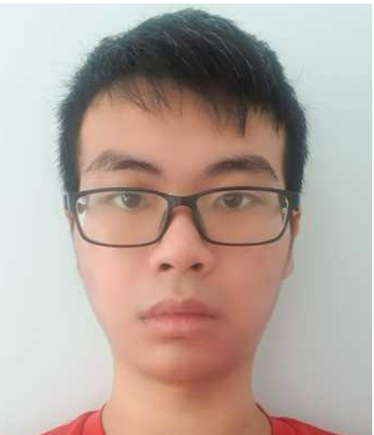
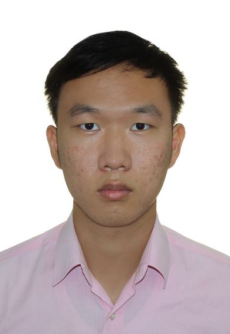
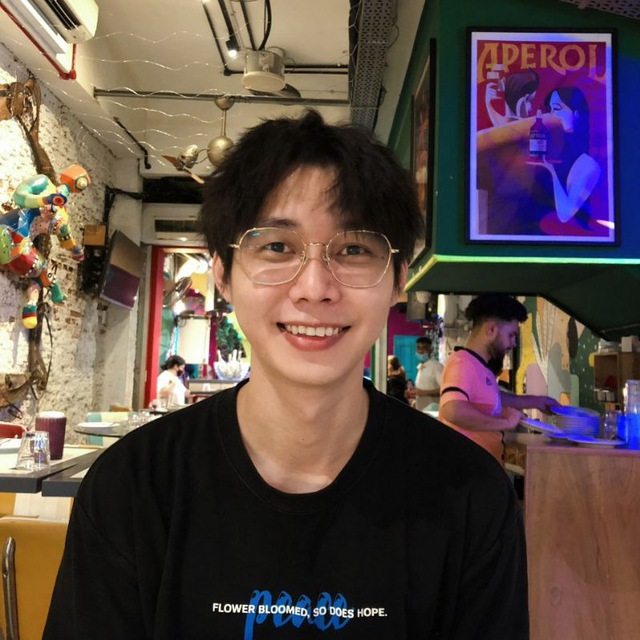

We are a team based in the [School of Computing, National University of Singapore](http://www.comp.nus.edu.sg).

## Project team

### Tam Keng Hong

[[github](http://github.com/TamKengHong)]
[[portfolio](team/tamkenghong.md)]

* Role: Team Lead
* Responsibilities: UI

### Xu BoJie

[[github](http://github.com/bojie3)]
[[portfolio](team/bojie3.md)]

* Role: Developer
* Responsibilities: Attendance, Participation point, Testing, Documentation

### Kok Chun Zhi

[[github](http://github.com/chunzkok)]
[[portfolio](team/chunzkok.md)]

* Role: Developer
* Responsibilities: Class List: Insertion, Deletion and Grouping of Students (Class List)

### Li Chengyue

[[github](http://github.com/cyli133)]
[[portfolio](team/cyli133.md)]

* Role: Developer
* Responsibilities: ClassList, Alarm, Tests, Documentation

### Gu Haiwei

[[github](http://github.com/WilliamHaiweiGu)]
[[portfolio](team/williamhaiweigu.md)]

* Role: Developer
* Responsibilities: CSV import & export, JSON interaction improvement, command history navigation, testing.
