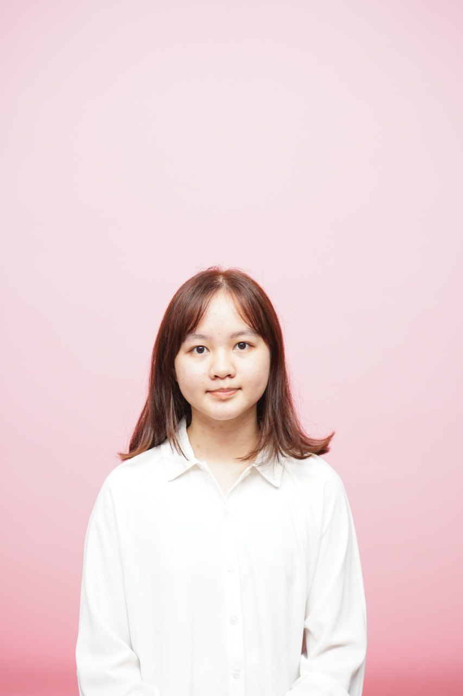
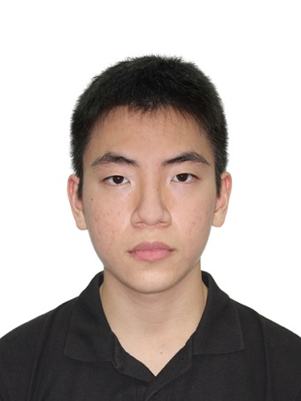
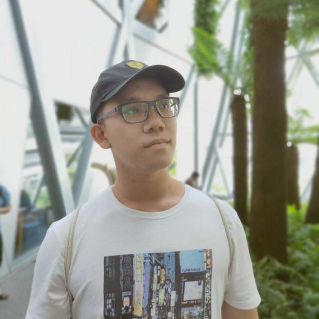
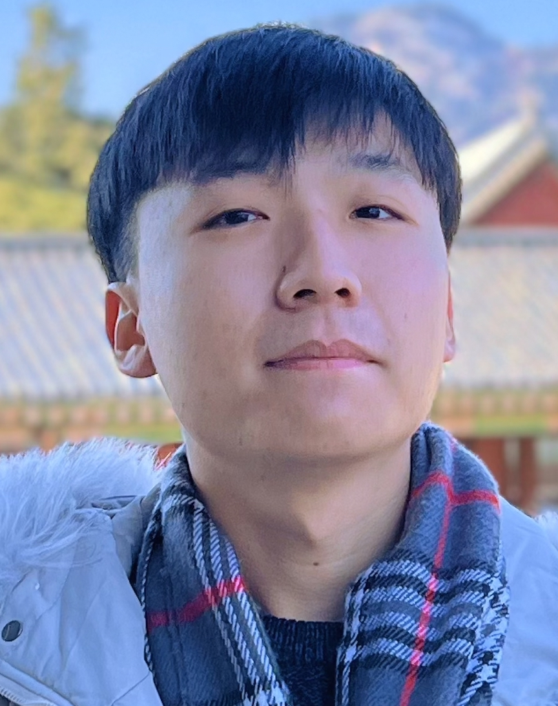

We are a team based in the [School of Computing, National University of Singapore](http://www.comp.nus.edu.sg).

You can reach us at the email `seer[at]comp.nus.edu.sg`

## Project team

### Carmen Ang

[[github](https://github.com/cmang12)]
[[portfolio](team/cmang12.md)]

* Role: Developer
* Responsibilities: Development

### Chia Yu Hong

[[github](https://github.com/chia-yh)]
[[portfolio](team/chia-yh.md)]

* Role: Developer

### Dillon Goh

[[github](http://github.com/dillongoh)] [[portfolio](team/dillongoh.md)]

* Role: Developer
* Responsibilities: Development

### Huang Hao

[[github](http://github.com/huanghao1998)]
[[portfolio](team/huanghao1998.md)]

* Role: Developer
* Responsibilities: Data

### Jeff Lee

[[github](http://github.com/nus-jeff)]
[[portfolio](team/nus-jeff.md)]

* Role: Developer
