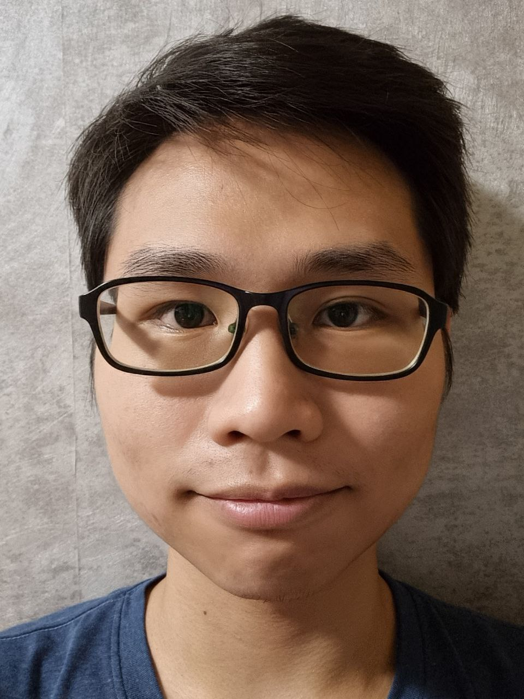
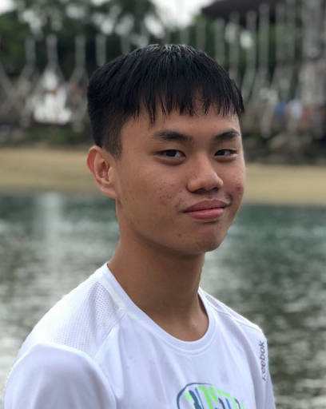
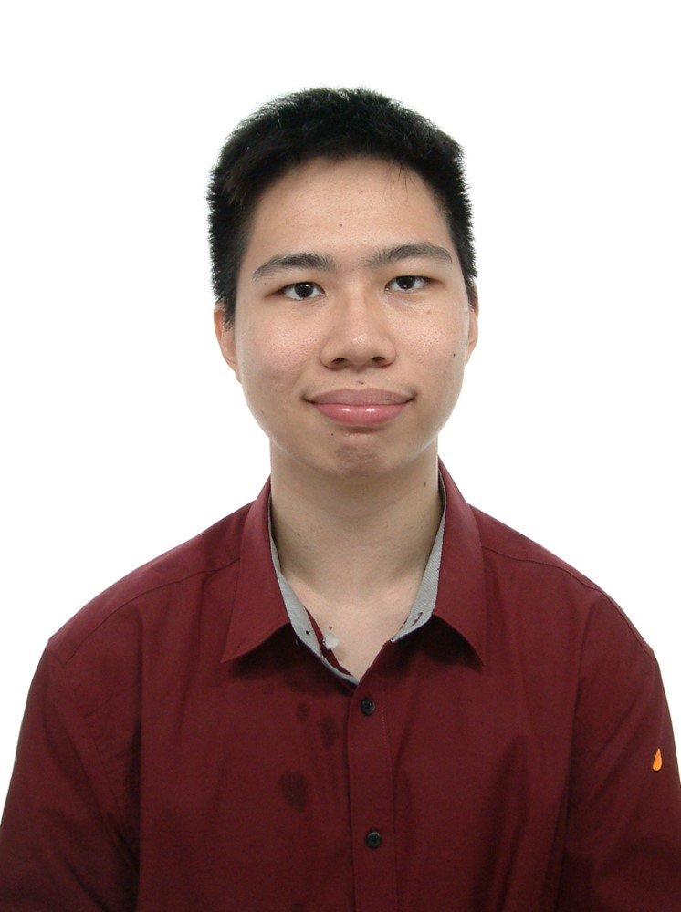
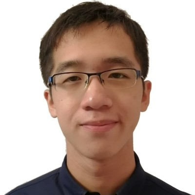
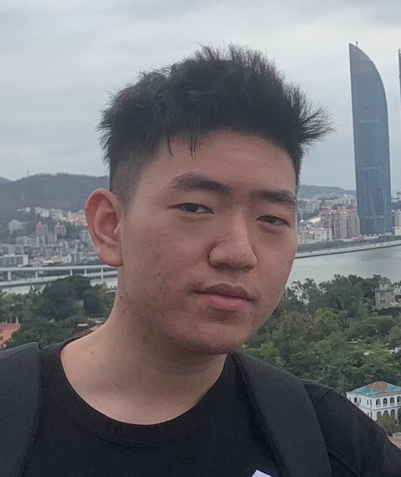

# About InternBuddy
We are team InternBuddy, and we are a team based in the [School of Computing, National University of Singapore](http://www.comp.nus.edu.sg).

You can reach us at the email `seer[at]comp.nus.edu.sg`

## Project Team

### Christopher Tan Rui Yang

[[github](https://github.com/potty10)]
[[portfolio](team/potty10.md)]

* Role: Team Lead
* Responsibilities: Testing

### Eugene Tang KangJie

[[github](http://github.com/eugenetangkj)]
[[portfolio](team/eugenetangkj.md)]

* Role: Developer
* Responsibilities: UI, Documentation

### Koh Kai Xun

[[github](http://github.com/kohkaixun)]
[[portfolio](team/kohkaixun.md)]

* Role: Developer
* Responsibilities: Code Quality

### Lim Hai Leong Shawn

[[github](http://github.com/seadragon2000341)]
[[portfolio](team/seadragon2000341.md)]

* Role: Developer
* Responsibilities: Scheduling and Tracking, Deliverables and Deadlines

### Ou Chuhao

[[github](http://github.com/DerrickSaltFish)]
[[portfolio](team/derricksaltfish.md)]

* Role: Developer
* Responsibilities: Integration
