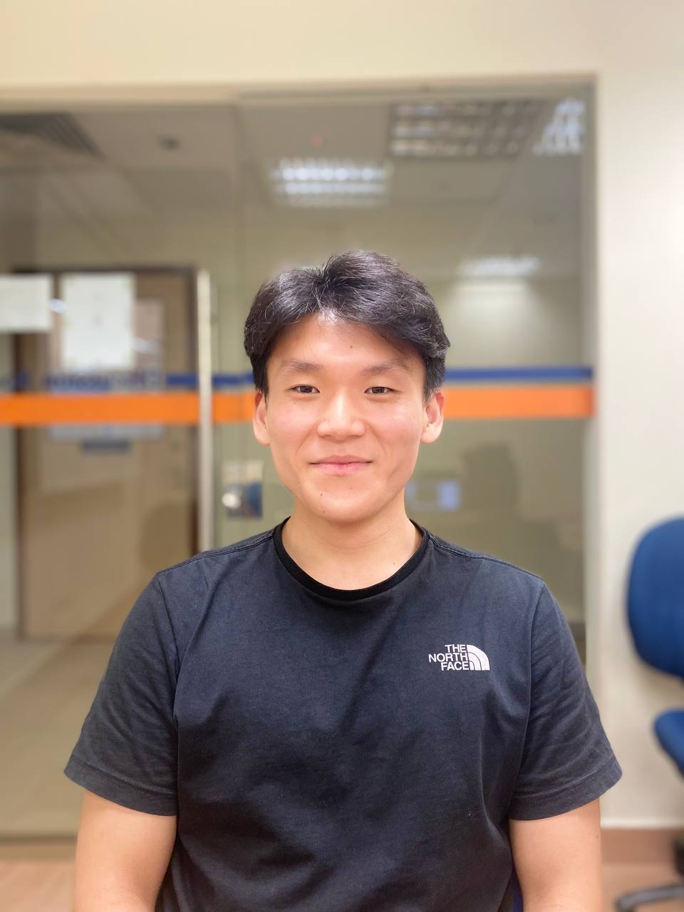
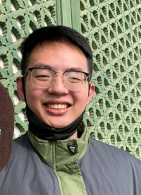
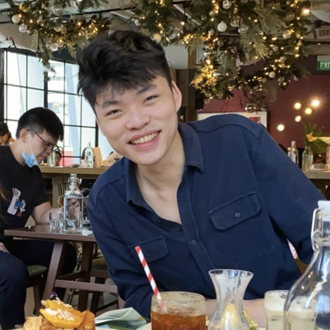

We are a team based in the [School of Computing, National University of Singapore](http://www.comp.nus.edu.sg).

## Project team

### Melvin Ong

[[github](https://github.com/mehvin)]
[[portfolio](team/mehvin.md)]

* Role: Project Advisor & Developer
* Responsibilities: Documentation + Code quality

### Muhammad Shazrin

[[github](http://github.com/shazxrin)]
[[portfolio](team/shazxrin.md)]

* Role: Developer
* Responsibilities: Code quality + Testing

### Oskar Lew

[[github](http://github.com/skeltons)] 
[[portfolio](team/skeltons.md)]

* Role: Developer
* Responsibilities: UI

### Joshua Tan

[[github](https://github.com/joshua-tyh)]
[[portfolio](team/joshua-tyh.md)]

* Role: Developer
* Responsibilities: Data
