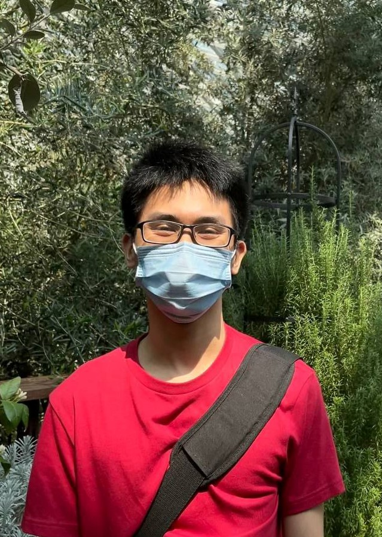
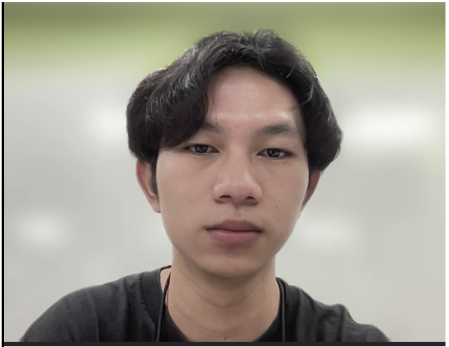
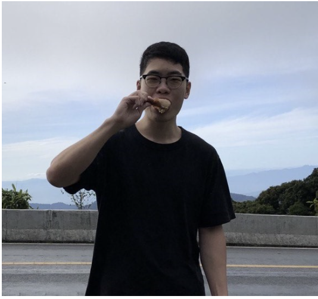

We are a team based in the [School of Computing, National University of Singapore](http://www.comp.nus.edu.sg).

You can reach us at the email `seer[at]comp.nus.edu.sg`

## Project Team

### Ho Yin

[[github](https://github.com/lhy-hoyin)]
[[portfolio](team/lhy-hoyin.md)]

* Role: Team Lead
* Responsibilities: Code Integration

### Jeremy

[[github](http://github.com/JrmCkh)]
[[portfolio](team/jrmckh.md)]

* Role: Team Assistant
* Responsibilities: UI

### Yu Quan

[[github](http://github.com/BigheartSmallbrain)]
[[portfolio](team/bigheartsmallbrain.md)]

* Role: Developer
* Responsibilities: Data

### Anthony

[[github](http://github.com/anthonynmh)]
[[portfolio](team/anthonynmh.md)]

* Role: Developer
* Responsibilities: Dev Ops + Threading
