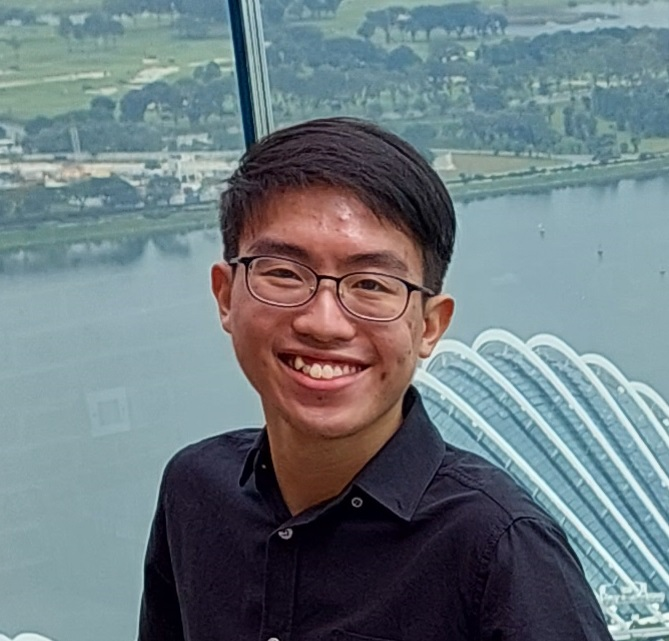
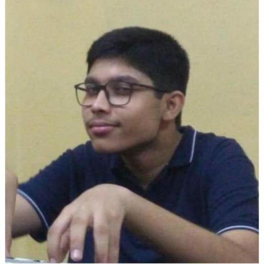
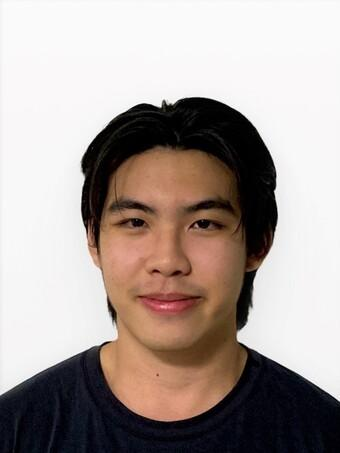

We are a team based in the [School of Computing, National University of Singapore](http://www.comp.nus.edu.sg).

You can reach us at the email `seer[at]comp.nus.edu.sg`

## Project team

### Chia Zi Xuan

[[github](https://github.com/zxisatree)]
[[portfolio](team/zxisatree.md)]

* Role: Project Advisor
* Responsibilities: Integration + Testing

### Arkobrata Chaudhuri

[[github](http://github.com/redHat-arko)]
[[portfolio](team/redhat-arko.md)]

* Role: Team Lead
* Responsibilities: Integration, Documentation

### Jayanth Balasubramanian

[[github](https://github.com/Jayanth-Balasubramanian)]
[[portfolio](team/jayanth-balasubramanian.md)]

* Role: Team Lead
* Responsibilities: UI, Git expert

### Chua Wen Hong

[[github](https://github.com/runoutofit)]
[[portfolio](team/runoutofit.md)]

* Role: Developer
* Responsibilities: UI, Code Quality, Documentations
