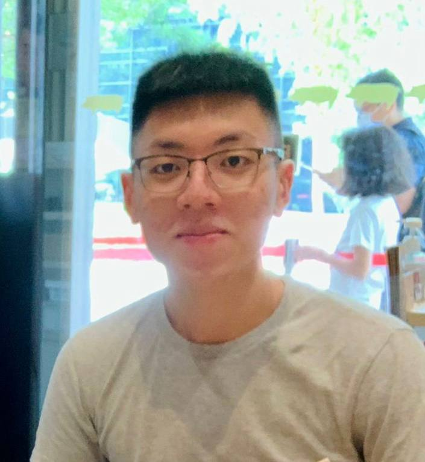

We are a team based in the [School of Computing, National University of Singapore](http://www.comp.nus.edu.sg).

You can reach us at the email `T17-3[at]comp.nus.edu.sg`

## Project team

### Jeffrey Lee

[[github](https://github.com/jefrai)]
[[portfolio](team/jefrai.md)]

* Role: Team Lead, Project Coordinator

### Hoang Huu Chinh

[[github](http://github.com/hhchinh2002)]
[[portfolio](team/hhchinh2002.md)]

* Role: Advisor, Designer
* Responsibilities: UI/UX

### Winson Heng

[[github](http://github.com/winsonheng)] 
[[portfolio](team/winsonheng.md)]

* Role: Developer
* Responsibilities: Data & Pipelining

### Leon Poh

[[github](http://github.com/leonpoh)]
[[portfolio](team/leonpoh.md)]

* Role: Developer
* Responsibilities: Develop new features + testings

### Gong Chen Jun

[[github](http://github.com/0x787af25e)]
[[portfolio](team/0x787af25e.md)]

* Role: Developer, Documenter
* Responsibilities: UI, User and Developer Guides

