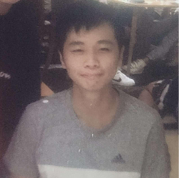
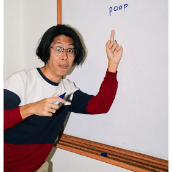
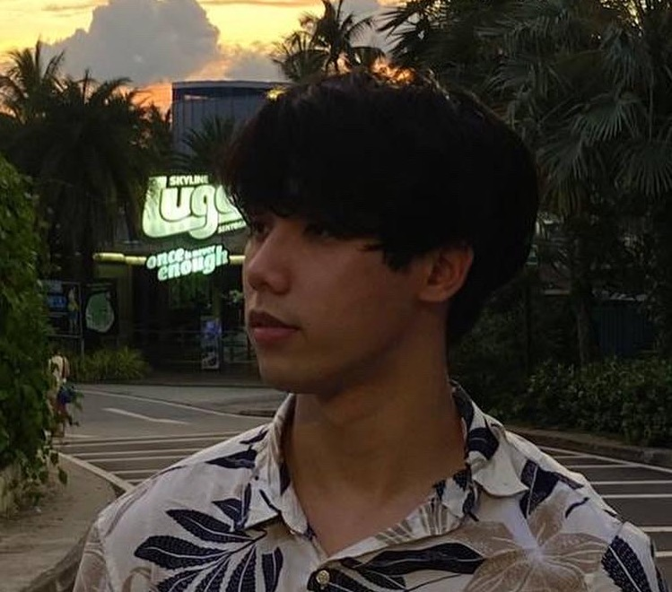
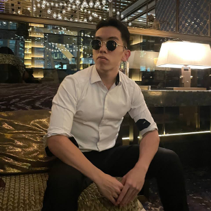
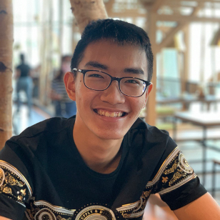

We are a team based in the [School of Computing, National University of Singapore](http://www.comp.nus.edu.sg).

You can reach us at the email `seer@comp.nus.edu.sg`

## Project team

### Alson

[[github](https://github.com/alson001)]
[[portfolio](team/alson001.md)]

- Role: Project Advisor
- Responsibilities: ***TBC***

### Filbert Phang

[[github](http://github.com/filbertphang)]
[[portfolio](team/filbertphang.md)]

- Role: Testing, Scheduling and tracking
- Responsibilities: UI, Bug fixes, Issue tracking

### James Liu Zixin

[[github](http://github.com/jamesliuzx)]
[[portfolio](team/jamesliuzx.md)]

- Role: Team Lead, UI Head
- Responsibilities: UI, Code Quality 

### Ong Seeu Sim

[[github](http://github.com/SeeuSim)]
[[portfolio](team/seeusim.md)]

- Role: Code Quality, Integration Head
- Responsibilities: Core Infrastructure, Code Validation, Project Management

### Tang Zong Hao

[[github](http://github.com/zhtang29)]
[[portfolio](team/zhtang29.md)]

- Role: Deliverables, Tracking and Deadlines Head, Documentation Head
- Responsibilities: ***TBC***
