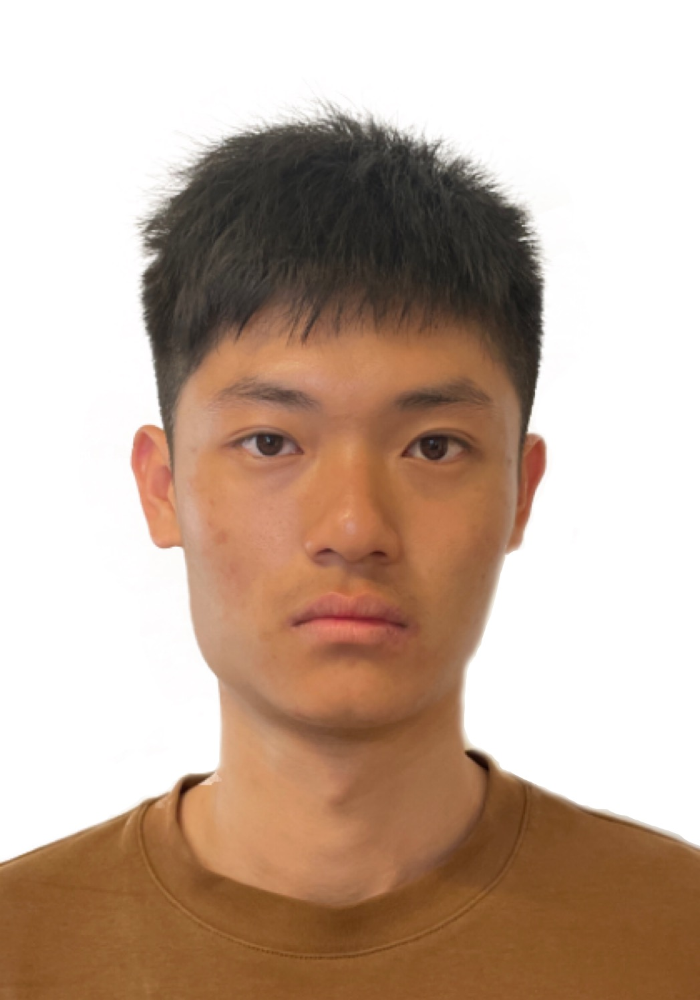
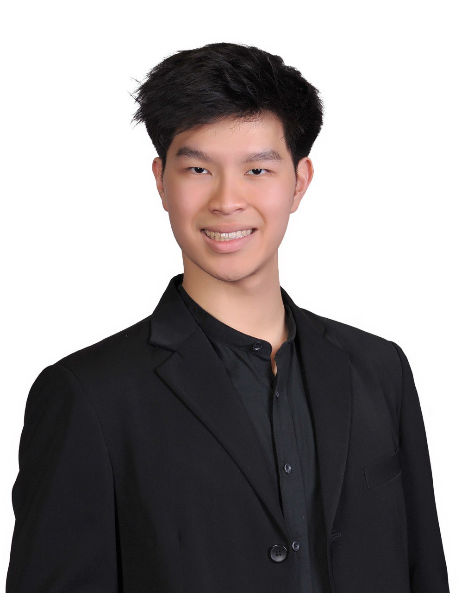
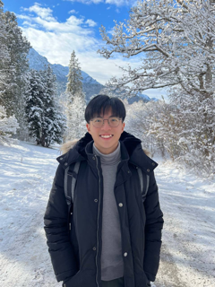
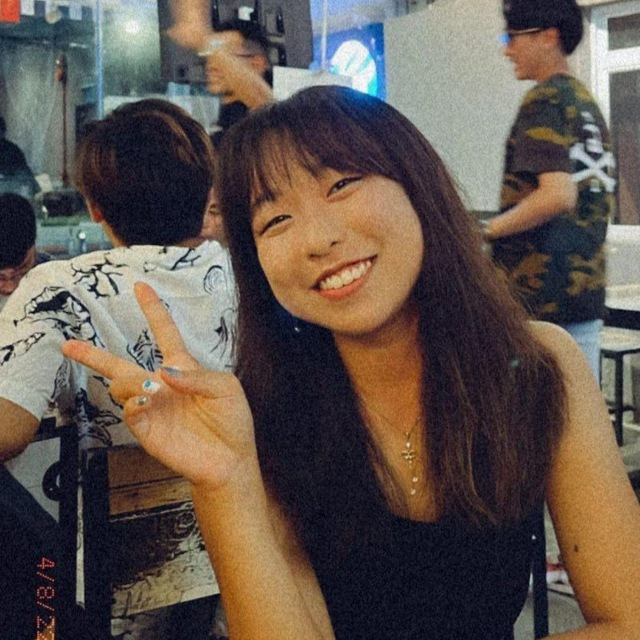

We are a team based in the [School of Computing, National University of Singapore](http://www.comp.nus.edu.sg).

You can reach us at the email `seer[at]comp.nus.edu.sg`

## Project team

### Yeoh Yong Jie

[[homepage](https://yeohyongjie.com)]
[[github](https://github.com/yyj-02)]
[[portfolio](team/yyj-02.md)]

* Role: Lead Developer

### Tan Homun

[[github](https://github.com/homuntan02)]
[[portfolio](team/homuntan02.md)]

* Role: Developer, Quality Assurance

### Clevon Wong

[[github](https://github.com/clevon-w)] [[portfolio](team/clevon-w.md)]

* Role: Developer, UI/UX

### Nicholas Tan

[[github](http://github.com/nt-nic)]
[[portfolio](team/nt-nic.md)]

* Role: Developer, Documentation

### Branda Ang

[[github](http://github.com/panpannnnn)]
[[portfolio](team/panpannnnn.md)]

* Role: Developer, Documentation
