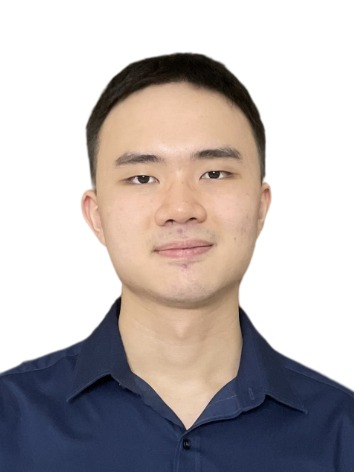

We are a team based in the [School of Computing, National University of Singapore](http://www.comp.nus.edu.sg).

You can reach us at the email `seer[at]comp.nus.edu.sg`

## Project team

### Lee Jia Sheng

[[github](https://github.com/jiasheng59)]
[[portfolio](team/jiasheng59.md)]

* Role: Developer
* Responsibilities: `Statistics`, `Find` , `Sort` and `Help` feature

### Lai Hui Qi

[[github](http://github.com/laihuiqi)]
[[portfolio](team/laihuiqi.md)]

* Role: Developer
* Responsibilities: `Clear`, `Clear_by`, `Delete`, `Exit`, `Revert`, `Revert_all` and `Task Package` related features

### Benjamin Wee 

[[github](http://github.com/benjamin-wee)] [[portfolio](team/benjamin-wee.md)]

* Role: Developer
* Responsibilities: `list` feature

### Lau Zhan Ming

[[github](http://github.com/zm-l)]
[[portfolio](team/zm-l.md)]

* Role: Developer
* Responsibilities: 
    * Implement feature to manage internship application: `add`, `edit`
    * GUI for `add`, `edit`, `delete`, `archive`, `unarchive`

### Lok Jian Ming

[[github](http://github.com/jianminglok)]
[[portfolio](team/jianminglok.md)]

* Role: Developer
* Responsibilities:
  * Contact management features: `add_contact`, `edit_contact`, `delete_contact`
  * Document management features: `add_docs`, `edit_docs`, `delete_docs`
  * Edit internship application status feature: `edit_status`
  * Archiving features: `archive`, `unarchive`, `list_archived`
