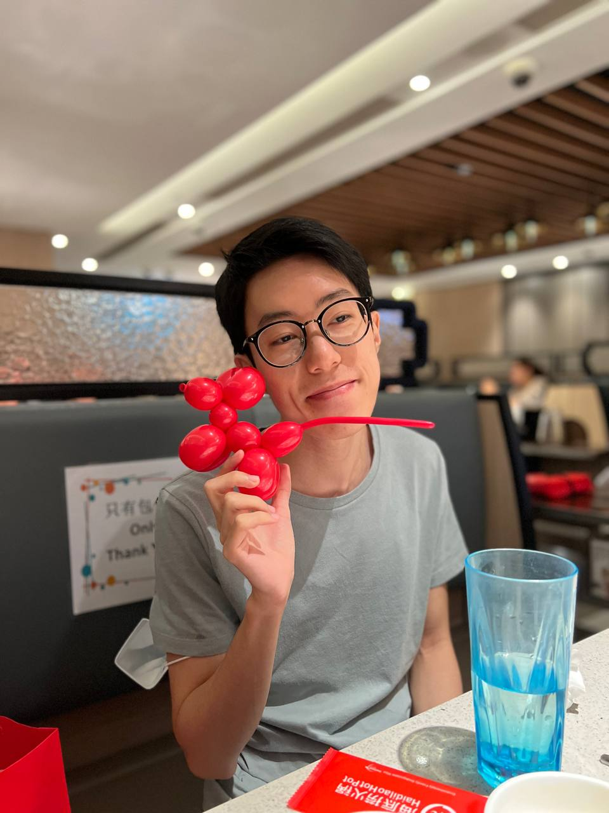
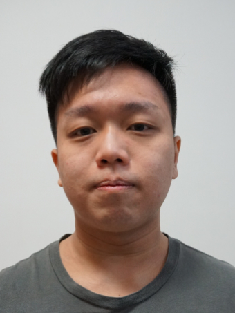
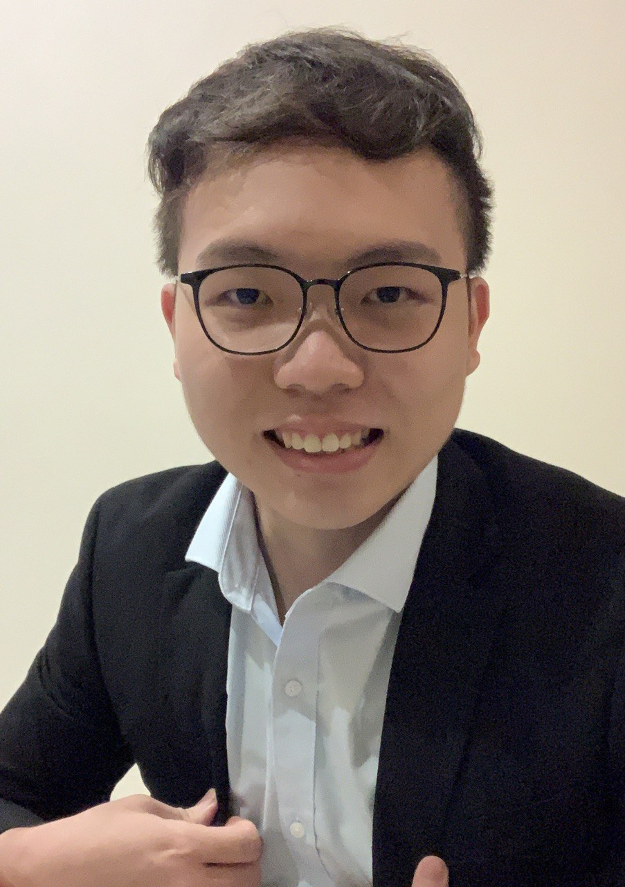
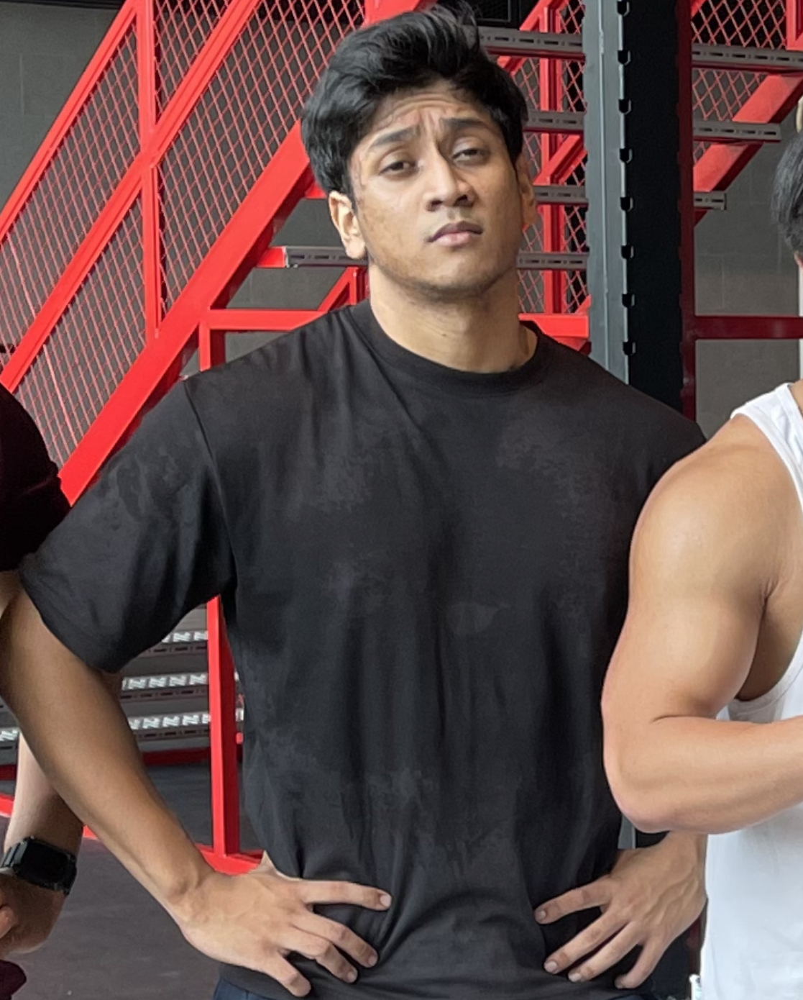

We are a team based in the [School of Computing, National University of Singapore](http://www.comp.nus.edu.sg).

## Project team

### Lee Hong Sheng

[[github](https://github.com/hongshenggg)]
[[portfolio](team/hongshenggg.md)]

* Role: Developer
* Responsibilities: Functions

### Ian

[[github](http://github.com/castryl)]
[[portfolio](team/castryl.md)]

* Role: Team Lead
* Responsibilities: Everything

### Lum Wee Kiat

[[github](http://github.com/weekiat-douze)] [[portfolio](team/weekiat-douze.md)]

* Role: Developer
* Responsibilities: Data

### Ni Shenghan

[[github](http://github.com/shni99)]
[[portfolio](team/shni99.md)]

* Role: Developer
* Responsibilities: Dev Ops + Threading

### Phone Khant Paing

[[github](http://github.com/pkpaing)]
[[portfolio](team/pkpaing.md)]

* Role: Developer
* Responsibilities: UI

