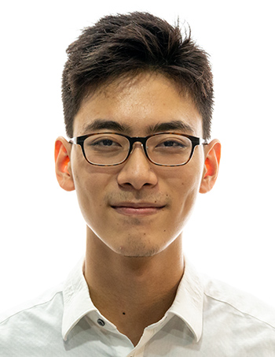

We are a team based in the [School of Computing, National University of Singapore](http://www.comp.nus.edu.sg).

You can reach us at the email `seer[at]comp.nus.edu.sg`

## Project team

### Muhammad Reyaaz

[[github](https://github.com/arpspoofing)]
[[portfolio](team/arpspoofing.md)]

* Role: Deliverables and deadlines

### Shi Jiaao

[[github](https://github.com/ShiJiaAo)]
[[portfolio](team/shijiaao.md)]

* Role: Deliverables and deadlines

### Chew Chun Kiat

[[github](http://github.com/nerdyboy98)]
[[portfolio](team/nerdyboy98.md)]

* Role: Member
* Responsibilities: Help and Sorting of events

### Eric

[[github](http://github.com/shittake)] 
[[portfolio](team/shittake.md)]

* Role: Developer
* Responsibilities: Data

### Jia Tong

[[github](http://github.com/JThh)]
[[portfolio](team/jthh.md)]

* Role: Developer
* Responsibilities: UI
