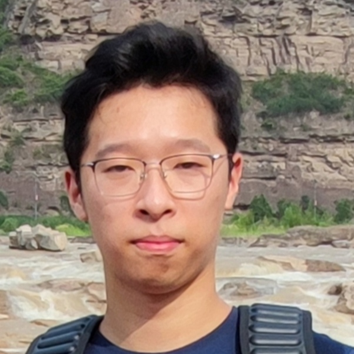
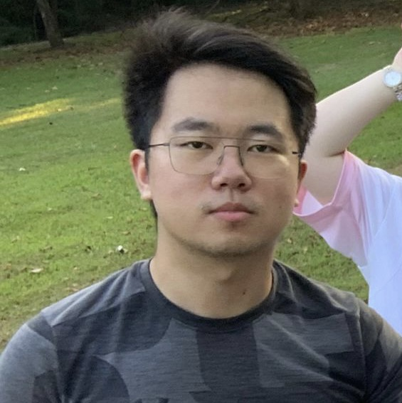
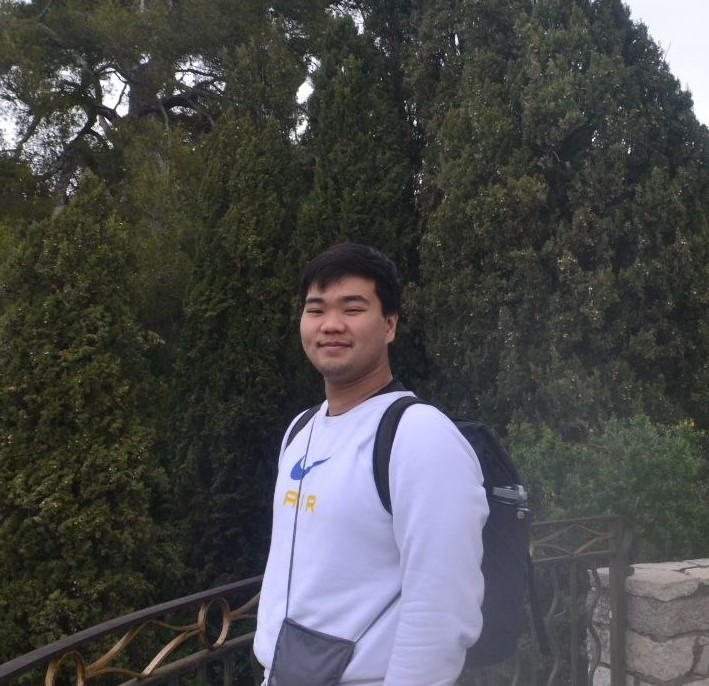
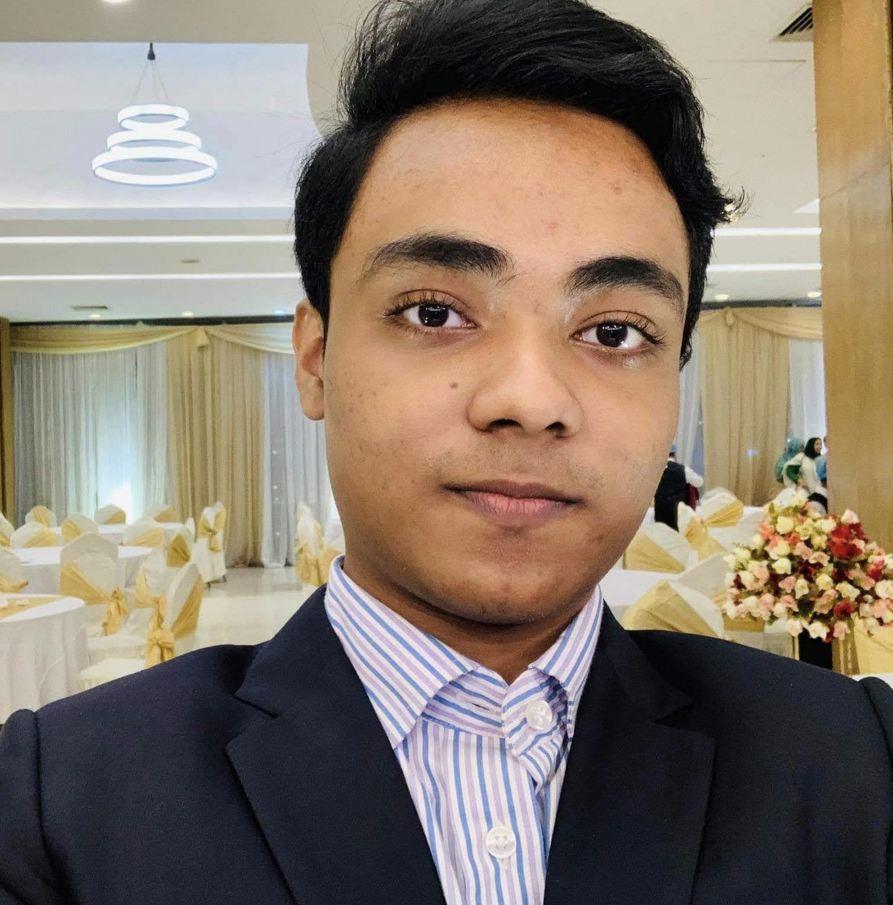

We are a team based in the [School of Computing, National University of Singapore](http://www.comp.nus.edu.sg).

You can reach us at these emails :
* `e0773591@u.nus.edu` - Zhu Yufan
* `e0774823@u.nus.edu` - Niu Boqian
* `e0727234@u.nus.edu` - Sze Jian Cheng
* `fahim.tajwar@u.nus.edu` - Muhammad Fahim Tajwar

## Project team

### Zhu Yufan

[[homepage](https://blog.zyf.ninja/)]
[[github](https://github.com/Yufannnn)]
[[portfolio](team/yufannnn.md)]

* Role: UI Design, Task Manager
* Responsibilities: manage and distribute tasks, design UI,  implementation, Developer Guide, UML Diagrams

### Niu Boqian

[[github](https://github.com/NBQian)]
[[portfolio](team/nbqian.md)]

* Role: coder
* Responsibilities: code

### Sze Jian Cheng

[[github](http://github.com/szejiancheng)] [[portfolio](team/szejiancheng.md)]

* Role: coder
* Responsibilities: UML diagrams, implementation, ~~and providing snacks~~

### Muhammad Fahim Tajwar

[[github](http://github.com/fahim-tazz)]
[[portfolio](team/fahim-tazz.md)]

* Role: Development, User and Developer Documentation, and Testing 
* Responsibilities: Developer Guide, User Guide, Unit and Integration Testing, Student Info Implementation
