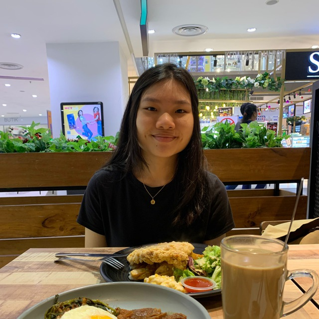
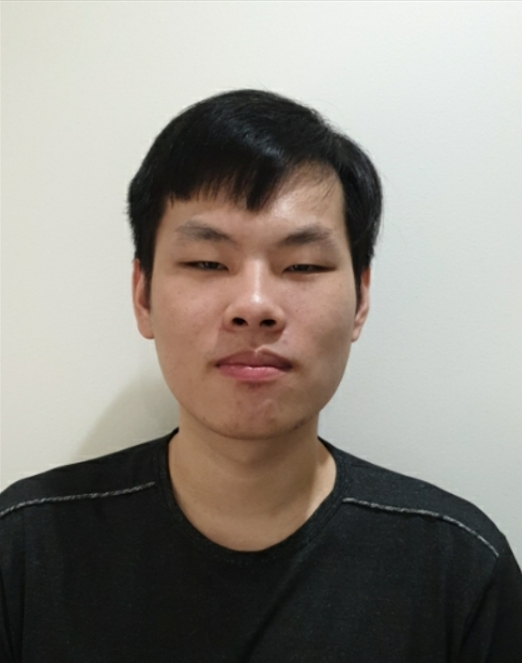
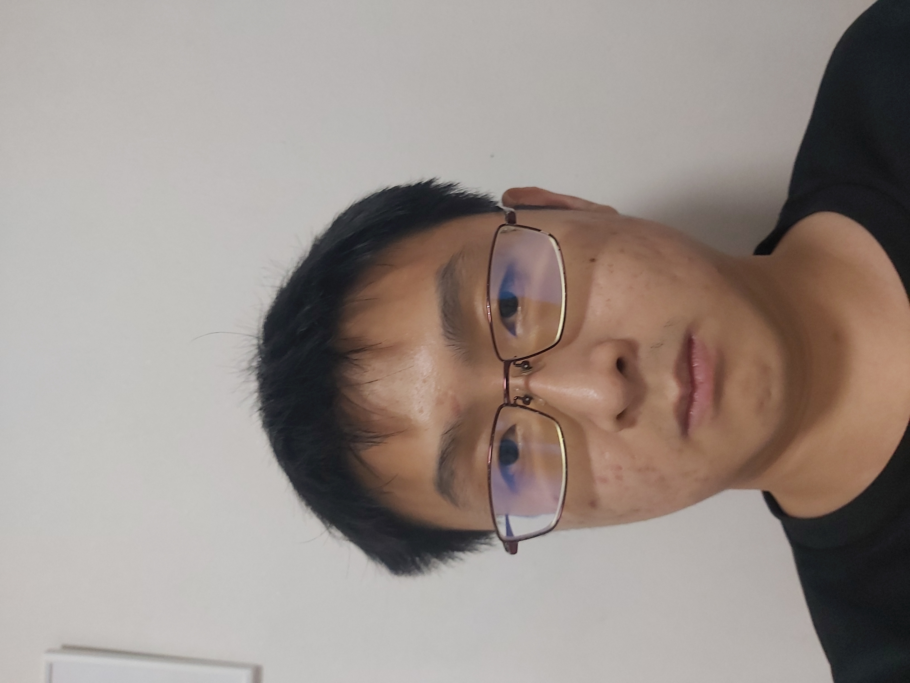
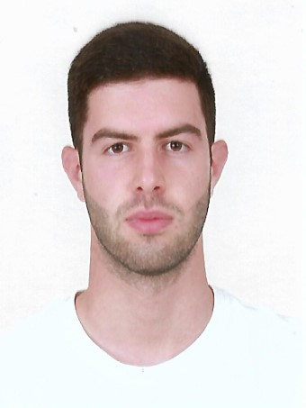

We are a team based in the [School of Computing, National University of Singapore](http://www.comp.nus.edu.sg).

You can reach us at our following emails:

1. Mandy Kaw: e0758899@u.nus.edu.sg
2.
3.
4. Stefanos Avraam: e0735360@u.nus.edu.sg

## Project team

### Mandy Kaw

[[github](http://github.com/mandykqh)]
[[portfolio](team/mandykqh.md)]

* Role: Developer
* Responsibilities: UI, Documentation, Implementation

### Thennant Lim

[[github](http://github.com/thennant)] [[portfolio](team/thennant.md)]

* Role: Developer
* Responsibilities: Data

### Low Jian Feng

[[github](http://github.com/peanutbutters93)]
[[portfolio](team/peanutbutters93.md)]

* Role: Developer
* Responsibilities: TBD

### Stefanos Avraam

[[github](https://github.com/StefanosAv)]
[[portfolio](team/johndoe.md)]

