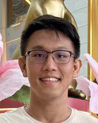
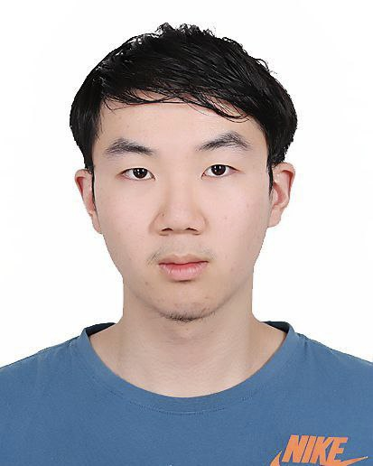
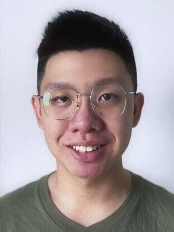
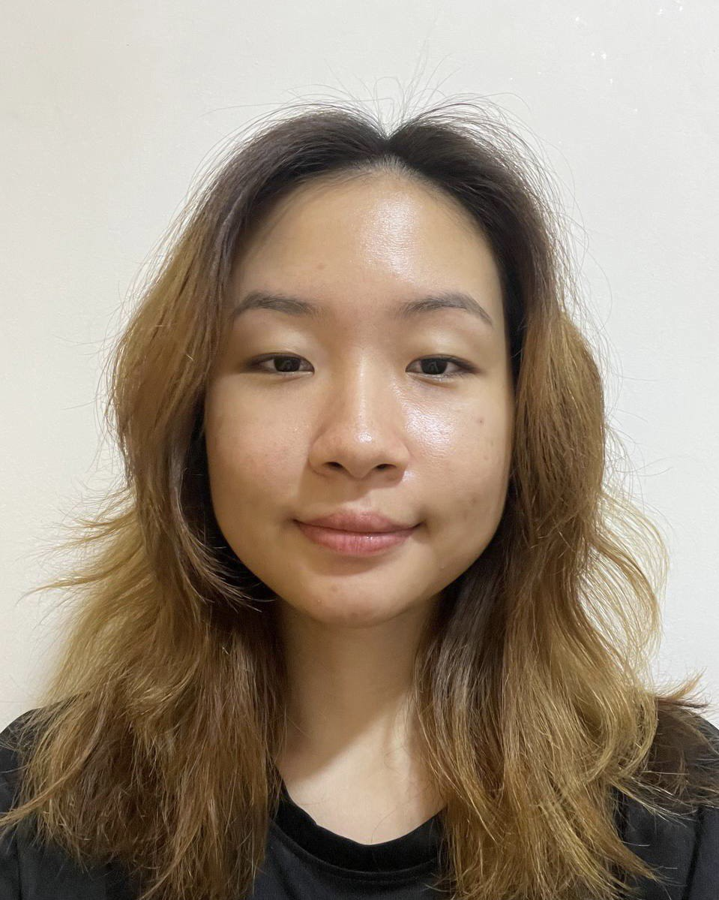
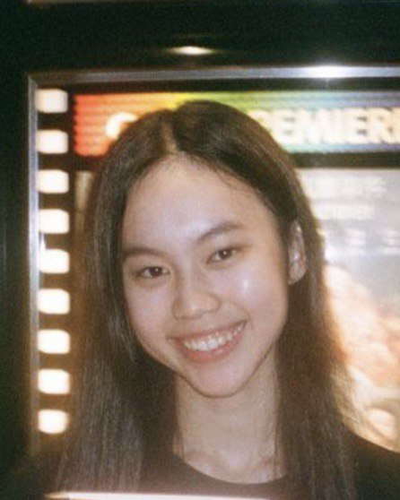

We are a team based in the [School of Computing, National University of Singapore](http://www.comp.nus.edu.sg).

## Project team

### Kang Yue Ran

[[github](http://github.com/kyueran)]
[[portfolio](team/kyueran.md)]

* Role: Team Lead
* Responsibilities: Model

### Ding Chiyu

[[github](http://github.com/Mr-Teal)]
[[portfolio](team/mr-teal.md)]

* Role: Developer
* Responsibilities: Logic

### Ryan Jansen

[[github](http://github.com/ryanjansen)]

* Role: Developer
* Responsibilities: Storage

### Germaine Lee

[[github](http://github.com/germainelee02)]
[[portfolio](team/germainelee02.md)]

* Role: Developer
* Responsibilities: Parser

### Bernice Toh

[[github](http://github.com/bernicetoh)]
[[portfolio](team/bernicetoh.md)]

* Role: Developer
* Responsibilities: UI
