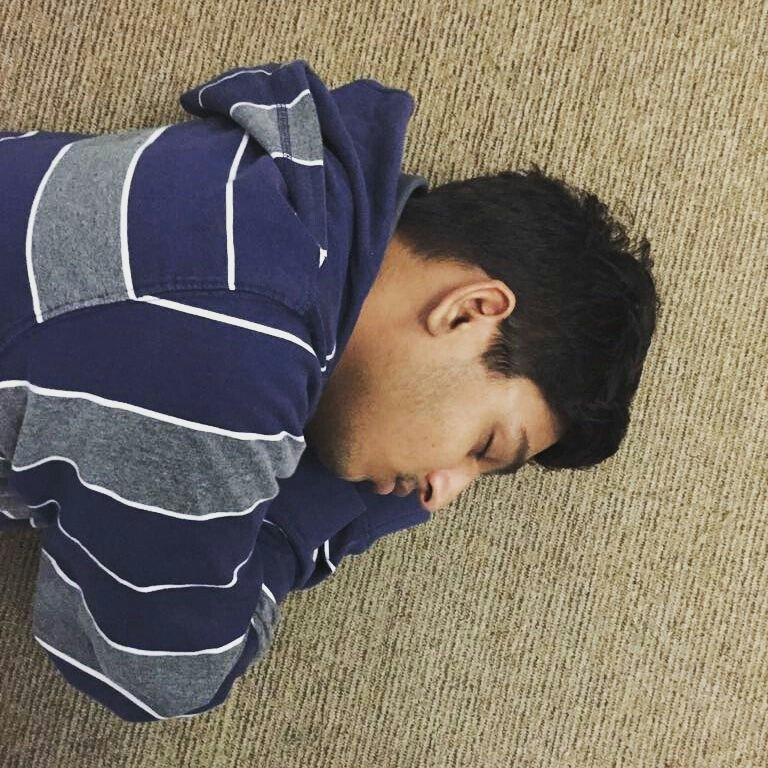
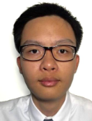

 

We are a team based in the [School of Computing, National University of Singapore](http://www.comp.nus.edu.sg).

You can reach us at the email `seer[at]comp.nus.edu.sg`

 

## Project Team

### Srinivasan Aarnav

[[GitHub](https://github.com/Flash161203)]
[[Portfolio](team/flash161203.md)]

* Role: `undecided`

 

### Chandrasekaran Akash

[[GitHub](https://github.com/Enigmatrix)]
[[Portfolio](team/enigmatrix.md)]

* Role: `undecided`

 

### Wang Jiefan

[[GitHub](https://github.com/Nafeij)]
[[Portfolio](team/nafeij.md)]

* Role: `undecided`

 

### Suresh Vaidyanaath

[[GitHub](https://github.com/vaidyanaath)]
[[Portfolio](team/vaidyanaath.md)]

* Role: `undecided`
