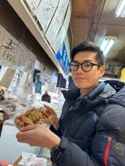
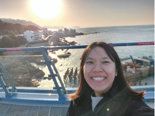
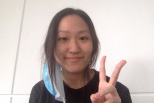

We are a team based in the [School of Computing, National University of Singapore](http://www.comp.nus.edu.sg).

## Project team

### Ang Jun Kang

[[github](https://github.com/Irminrics)]
[[portfolio](team/Irminrics.md)]

- Role: Team Lead
- Responsibilites: Pull request approver

### Jerome Neo

[[github](http://github.com/jerome-neo)]
[[portfolio](team/jerome-neo.md)]

- Role: Developer
- Responsibilities: Documentation, Testing

### Lim Jia Yi Venus

[[github](http://github.com/venuslimm)]
[[portfolio](team/venuslimm.md)]

- Role: Developer
- Responsibilities: Documentation Quality, Integration

### Lin Weilin

[[github](http://github.com/weilin1202)]
[[portfolio](team/weilin1202.md)]

- Role: Developer
- Responsibilities: Testing, Code Quality

### Song Yi, Ina

[[github](http://github.com/inas0ng)]
[[portfolio](team/inas0ng.md)]

- Role: Developer
- Responsibilities: Testing, Deliverables and Deadline
