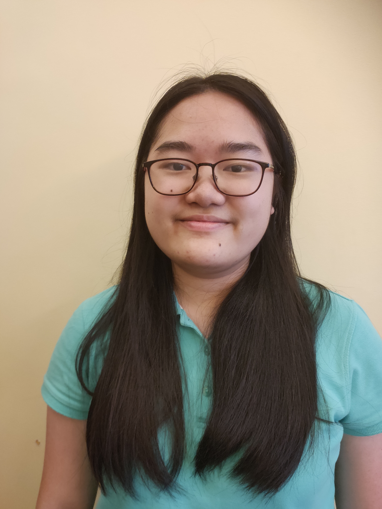
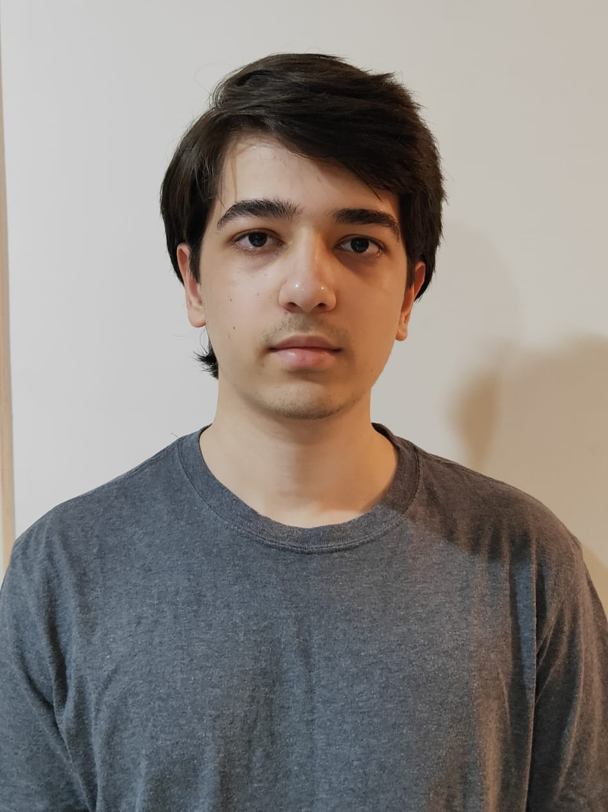
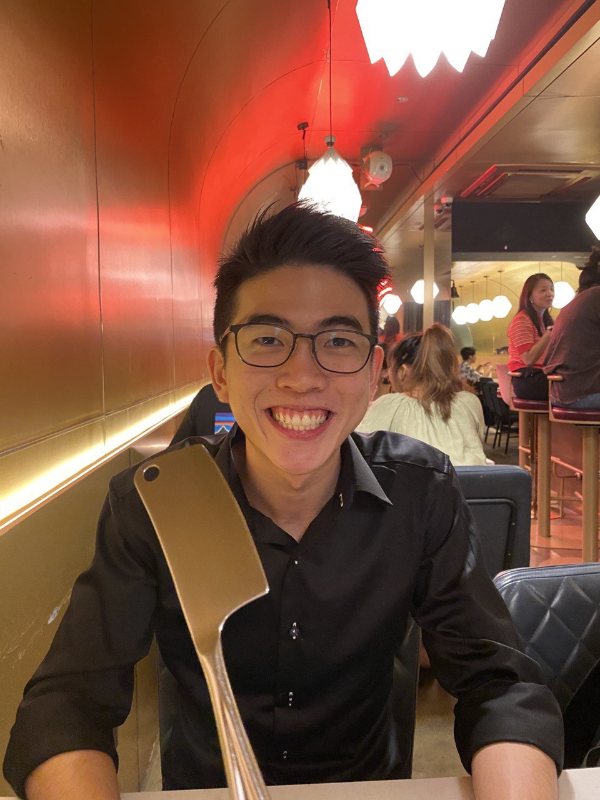
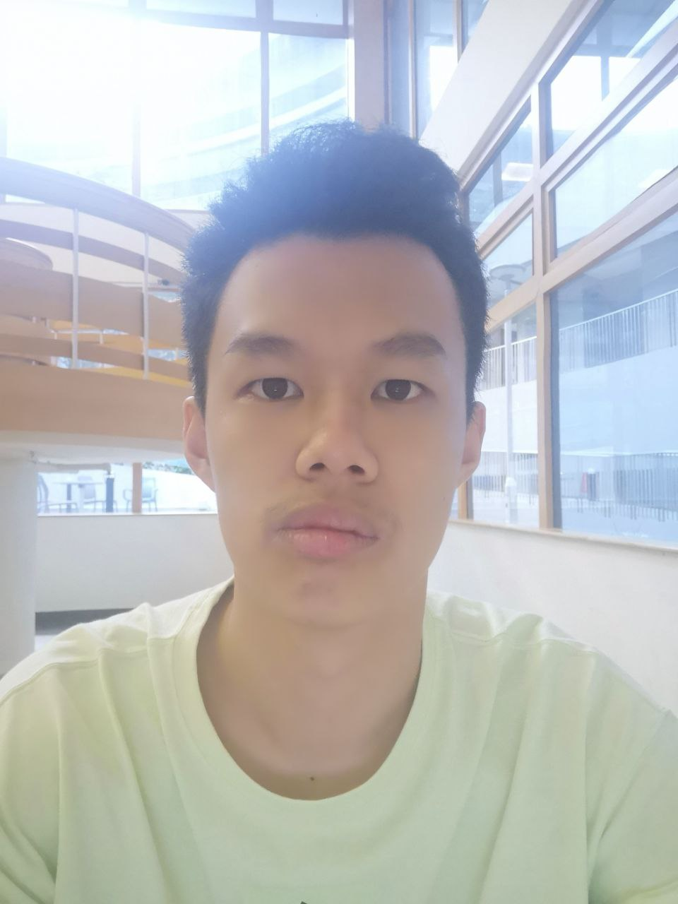

We are a team based in the [School of Computing, National University of Singapore](http://www.comp.nus.edu.sg).

You can reach us at the email `seer[at]comp.nus.edu.sg`

## Project team

### Lim Zhe Rui

[[github](https://github.com/zrei)]
[[portfolio](team/zrei.md)]

* Role: Team Lead
* Responsibilities: `to be added`

### Rishi Chousalkar

[[github](http://github.com/mmaimer33]
[[portfolio](team/mmaimer33.md)]

* Role: Team Member
* Responsibilities: Documentation

### Warren Yang

[[github](http://github.com/verydaftpunk)]
[[portfolio](team/verydaftpunk.md)]

* Role: Deliverables and deadlines, scheduling and tracking
* Responsibilities: 'to be added'

### John Chia

[[github](http://github.com/johnchiahk)]
[[portfolio](team/johnchiahk.md)]

* Role: Team Member
* Responsibilities: 'to be added'
