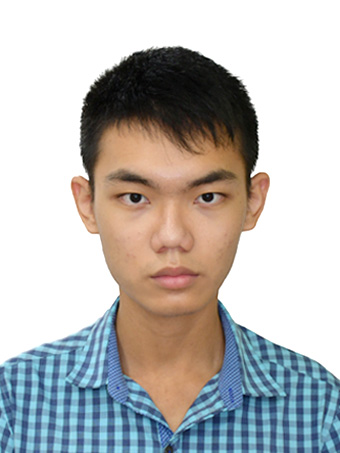

We are a team based in the [School of Computing, National University of Singapore](http://www.comp.nus.edu.sg).

You can reach us at the email `seer[at]comp.nus.edu.sg`

## Project team

### John Doe

[[homepage](http://www.comp.nus.edu.sg/~damithch)]
[[github](https://github.com/johndoe)]
[[portfolio](team/johndoe.md)]

* Role: Project Advisor

### Vigneshwar Hariharan

[[github](http://github.com/vigonometry)]
[[portfolio](team/vignesh.md)]

* Role: Team Lead
* Responsibilities: UI

### Amos Hung

[[github](http://github.com/Bobfree546)] [[portfolio](team/amos.md)]

* Role: Developer
* Responsibilities: Data

### Krishnamoorthi Praveen

[[github](http://github.com/praveenkrishna0512)]
[[portfolio](team/praveen.md)]

* Role: Developer
* Responsibilities: Dev Ops + Threading

### Owen Yap Yuhan

[[github](http://github.com/owen-yap)]
[[portfolio](team/owen.md)]

* Role: Developer
* Responsibilities: UI
