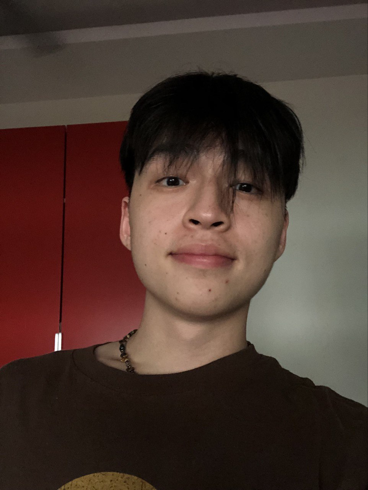

We are a team based in the [School of Computing, National University of Singapore](http://www.comp.nus.edu.sg).

You can reach us at the email `seer[at]comp.nus.edu.sg`

## Project team

### Titus Lowe

[[github](https://github.com/tituswe)]
[[portfolio](team/tituswe.md)]

* Role: Developer (Co-team lead)
* Responsibilities: Front-end, UI. In charge of `select` command. Assigns gitHub issues, took charge of handling milestones and managed merged requests. 

### Ang Yuze

[[github](http://github.com/yzmunchmunch)]
[[portfolio](team/yzmunchmunch.md)]

* Role: Developer    
* Responsibilities: In charge of `Policy` class. 

### Pang Rui Wei

[[github](https://github.com/pangrwa)]
[[portfolio](team/pangrwa.md)]

* Role: Developer (Co-team lead) 
* Responsibilities: Back-end, storage. In charge of `deletePolicy`, `editPolicy`, `addApt`, `deleteApt` commands. In charge of User Guide and Developer Guide. Handles gitHub releases and managed merged requests.

### Lu Chenyu

[[github](http://github.com/adam07018)]
[[portfolio](team/adam07018.md)]

* Role: Developer
* Responsibilities: In charge of `undo`, `redo`, `sortClientEmail`, `sortClientName`, `sortClientPhone` commands. 

### Anunaya Joshi

[[github](http://github.com/anunayajoshi)]
[[portfolio](team/anunayajoshi.md)]

* Role: Developer
* Responsibilities: In charge of `addPolicy` command and refactoring.
