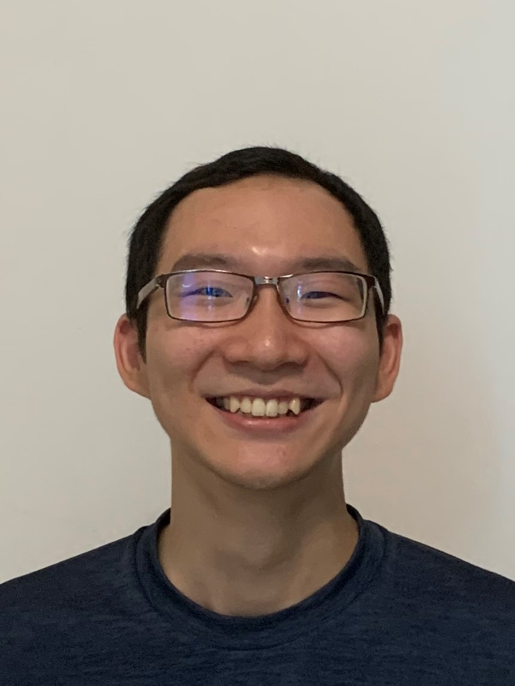
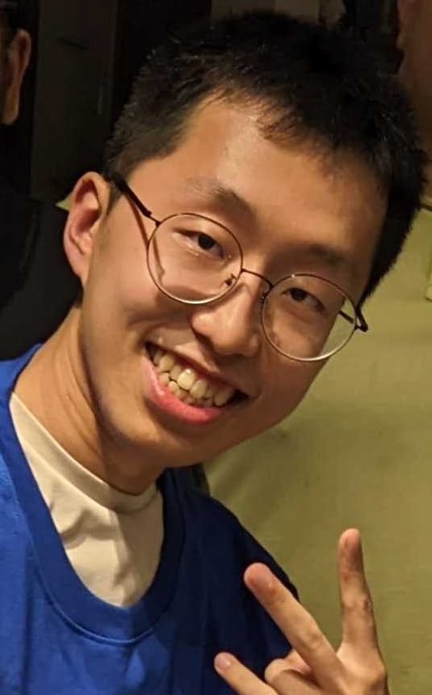
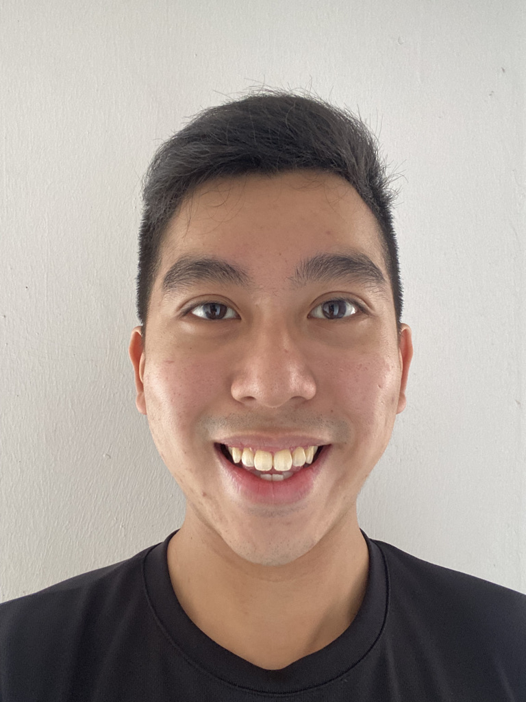
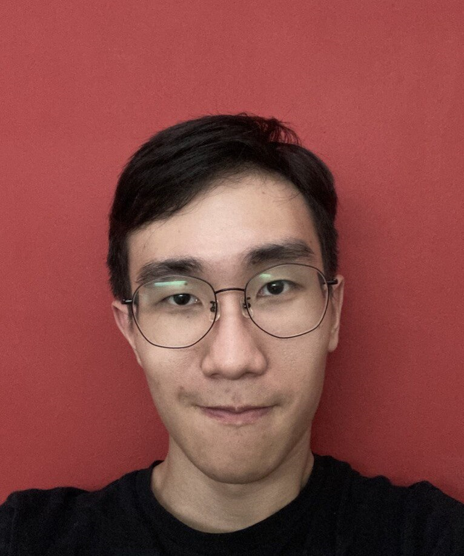

We are a team based in the [School of Computing, National University of Singapore](http://www.comp.nus.edu.sg).

You can reach us at the email `seer[at]comp.nus.edu.sg`

## Project team

### Lee Wei Chong Stefan

\[[github](https://github.com/rexcyrio)\] \[[portfolio](team/rexcyrio.md)\]

- Role: Team Lead
- Responsibilities: Code Quality

### Kim Young Jin

\[[github](http://github.com/jugheadjones10)\] \[[portfolio](team/jugheadjones10.md)\]

- Role: Developer
- Responsibilities: Testing

### Neo Ming Hao

\[[github](http://github.com/minosx31)\] \[[portfolio](team/minosx31.md)\]

- Role: Developer
- Responsibilities: Deliverables and deadlines

### Fun Leon

\[[github](http://github.com/niekis)\] \[[portfolio](team/niekis.md)\]

- Role: Developer
- Responsibilities: Documentation
