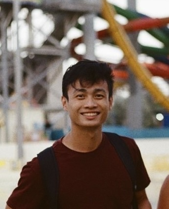
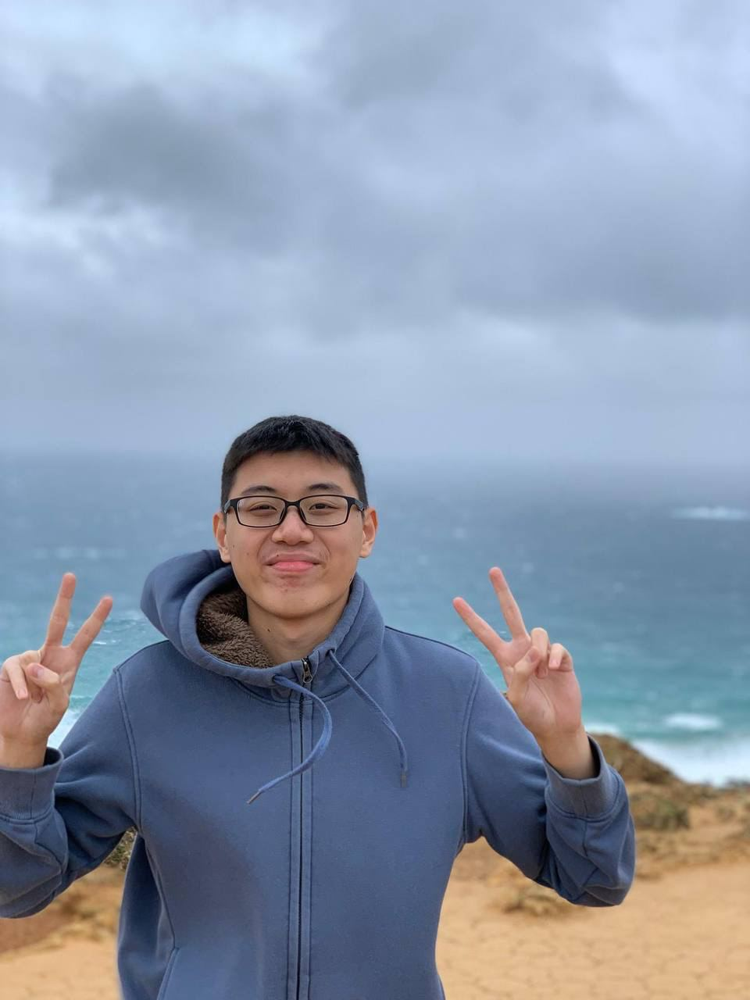
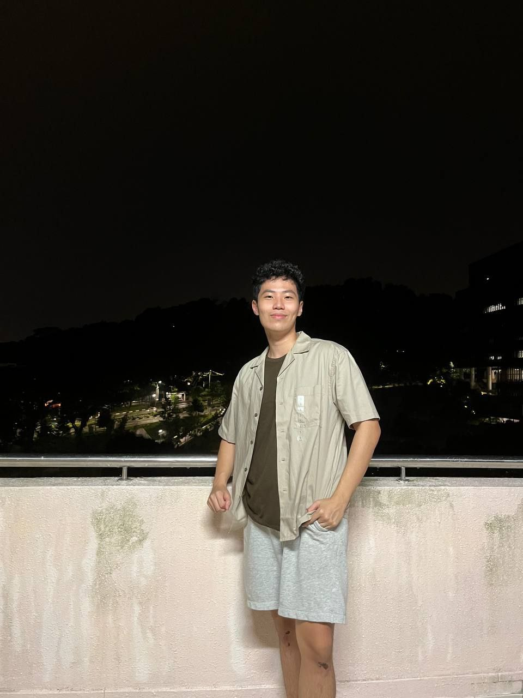
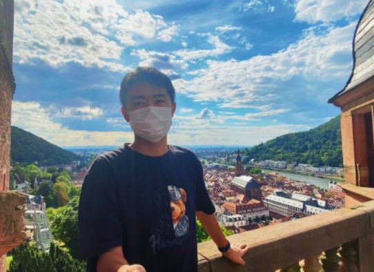

We are a team based in the [School of Computing, National University of Singapore](http://www.comp.nus.edu.sg).

## Project team

### Jonathon Low Eng Kiat

[[github](https://github.com/Creationsv2)]
[[portfolio](team/creationsv2.md)]

* Role: Developer
* Responsibilities: Data Querying

### Ong Wei Jie

[[github](http://github.com/ongweijie7)]
[[portfolio](team/ongweijie7.md)]

* Role: Developer
* Responsibilities: Data Filtering

### Sean Chin Jun Kai

[[github](http://github.com/seanchinjunkai)]
[[portfolio](team/seanchinjunkai.md)]

* Role: Developer
* Responsibilities: Help function

### Ma Yu Chen

[[github](http://github.com/dawg420)]
[[portfolio](team/dawg420.md)]
* Role: Developer
* Responsibilities: Data Management/Storage

### Pei Wenqi

[[github](http://github.com/cedricpei)]
[[portfolio](team/cedricpei.md)]

* Role: Developer
* Responsibilities: GUI + Undo/redo + View
