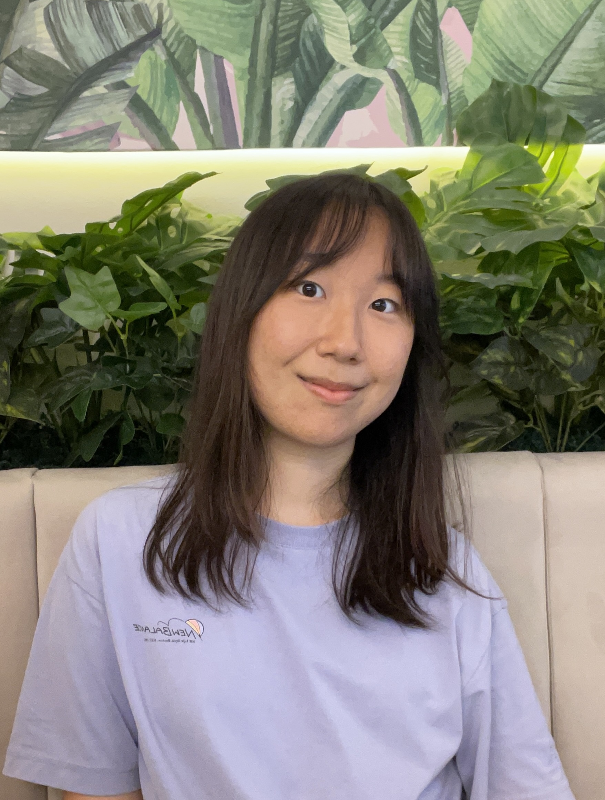

We are a team based in the [School of Computing, National University of Singapore](http://www.comp.nus.edu.sg).

## Project team

### Lin Chieh

[[github](https://github.com/euph00)]
[[portfolio](team/euph00.md)]

* Role: Team member
* Responsibilities: In charge of implementation of backend Model components.

### Zheng Ze

[[github](http://github.com/pzhengze)]
[[portfolio](team/pzhengze.md)]

* Role: Team member
* Responsibilities: In charge of Patient and Ward related commands, Storage, Ui. 

### Lucas

[[github](http://github.com/lukkesreysandeur)]
[[portfolio](team/lukkesreysandeur.md)]

* Role: Team member
* Responsibilities: In charge of Staff class and related commands, User Guide

### Glenn Ong JunJie

[[github](https://github.com/GlennOngJunJie)]
[[portfolio](team/glennongjunjie.md)]

* Role: Team Member
* Responsibilities: In charge of implementing commands.

### Shin Jin

[[github](http://github.com/jinnieshin)]
[[portfolio](team/jinnieshin.md)]

* Role: Team member
* Responsibilities: In charge of updating UI components.
