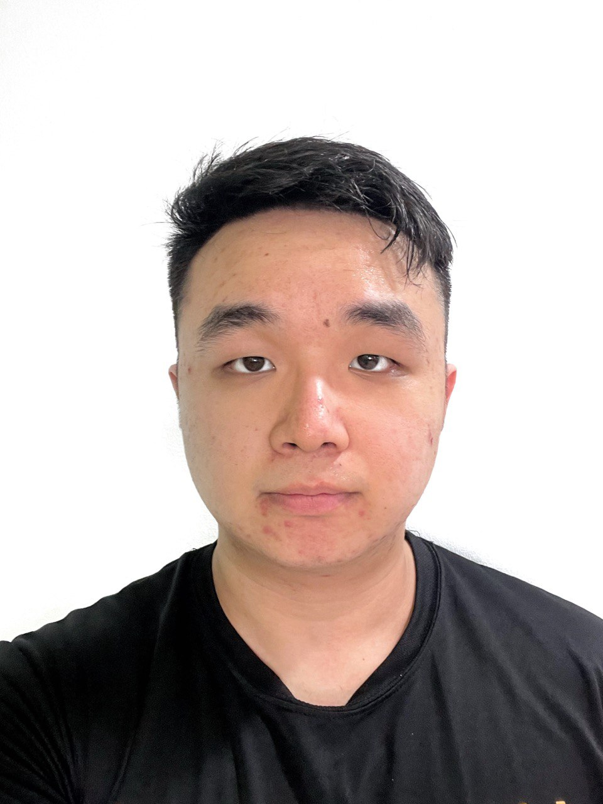
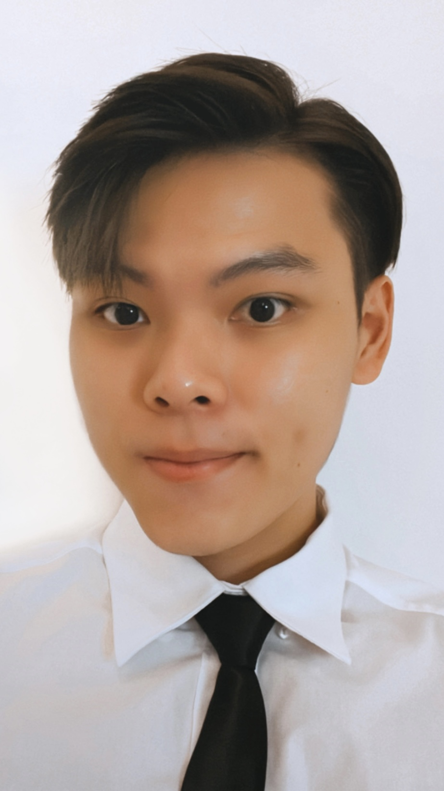
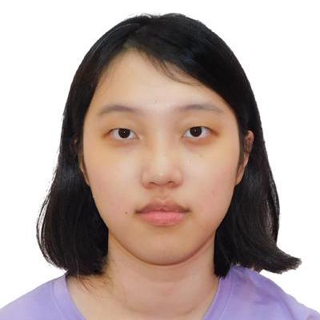

We are a team based in the [School of Computing, National University of Singapore](http://www.comp.nus.edu.sg).

You can reach us at the email `seer[at]comp.nus.edu.sg`

## Project team

### Wong Qin Yao (Sean)

[[github](https://github.com/extrashotlatte)]
[[portfolio](team/extrashotlatte.md)]

* Role: Deliverables and deadlines, Git Expert

### Bryan Ong

[[github](https://github.com/bryansendeavour)]
[[portfolio](team/bryansendeavour.md)]

* Role: Testing, JavaFX Expert

### Eng En Hui

[[github](https://github.com/engenhui1999)]
[[portfolio](team/engenhui1999.md)]

* Role: Integration, Documentation

### Gloria Zhang Xinhui

[[github](https://github.com/glozxi)]
[[portfolio](team/glozxi.md)]

* Role: Scheduling and Tracking, IntelliJ expert

### Bryan Tan Zhong Kang

[[github](https://github.com/EksdeeeX)]
[[portfolio](team/EksdeeeX.md)]

* Role: Code Quality, Team Lead
