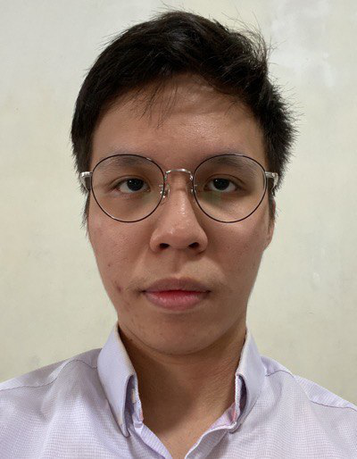
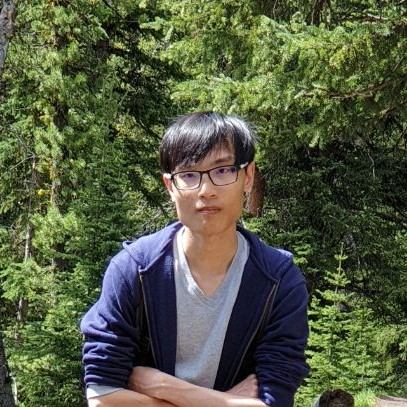
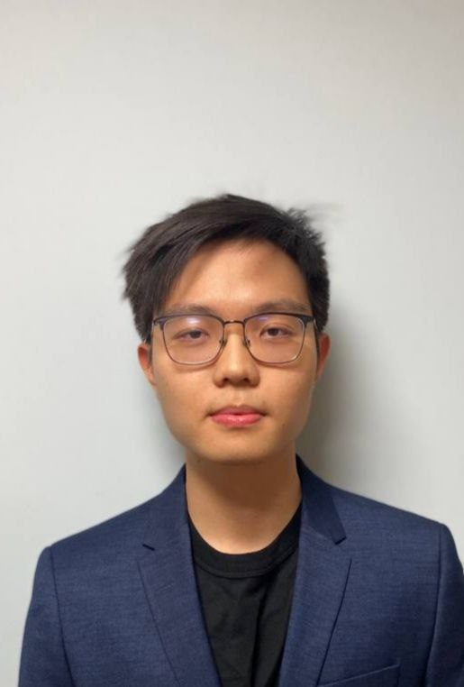

We are a team based in the [School of Computing, National University of Singapore](http://www.comp.nus.edu.sg).

## Project team

### Pan Zai Ming

[[github](https://github.com/pzaiming)]
[[portfolio](team/pzaiming.md)]

* Role: Developer
* Responsibilities: Development + Documentation

### Dylan Sng Jie An

[[github](https://github.com/dsja612)]
[[portfolio](team/dsja612.md)]

* Role: Full-Stack Developer
* Responsibilities: Frontend development + backend development

### Adriel Kee

[[github](http://github.com/amoonguss1)]
[[portfolio](team/amoonguss1.md)]

* Role: Coding, UI
* Responsibilities: Data

### Ryan Qiu

[[github](http://github.com/ryanqiu1)]
[[portfolio](team/ryanqiu1.md)]

* Role: Developer
* Responsibilities: Coding, UI

### UnwilledTangent / Sean Tin

[[github](https://github.com/UnwilledTangent)]
[[portfolio](team/UnwilledTangent.md)]

* Role: Software Developer
* Responsibilities: UI
