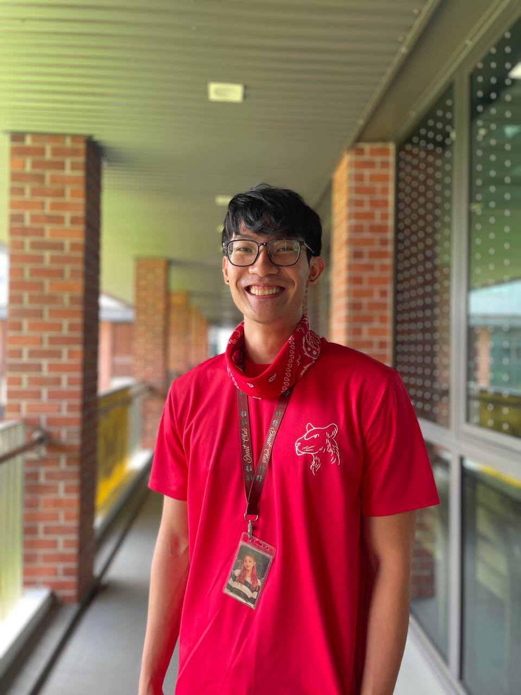

We are a team based in the [School of Computing, National University of Singapore](http://www.comp.nus.edu.sg).

You can reach us at the email `seer[at]comp.nus.edu.sg`

## Project team

### Chin Jun An

[[github](https://github.com/ChinJunAn)]

* Role: Developer
* Responsibilities: Notification and reminder function

### Do Ha Duong

[[github](https://github.com/dohaduong)]

* Role: Developer
* Responsibility: Timetable function

### Chen Zuo Hui

[[github](https://github.com/zuohui48)]

* Role: Developer
* Responsibilities: List jobs, Summary Statistics

### Zhu Le Yao

[[github](http://github.com/ZhuLeYao)]

* Role: Developer
* Responsibilities: Data, Add and view jobs function

### Chen Junsheng

[[github](http://github.com/c0j0s)]
[[portfolio](team/c0j0s.md)]

* Role: Developer
* Responsibilities: Delivery jobs function
