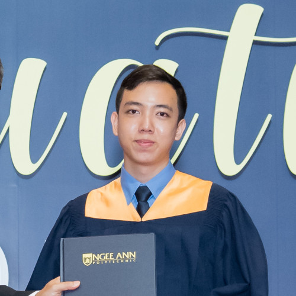
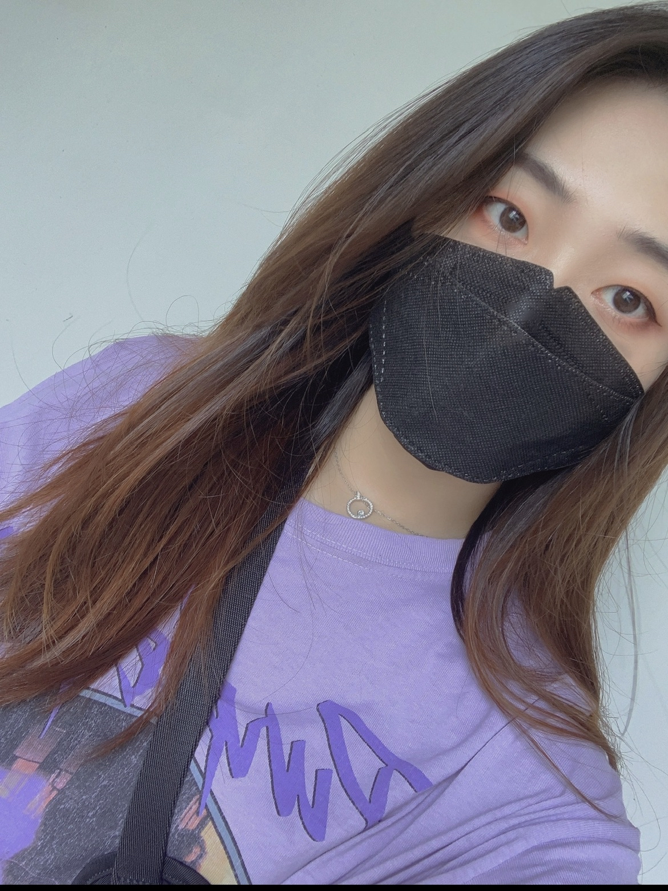
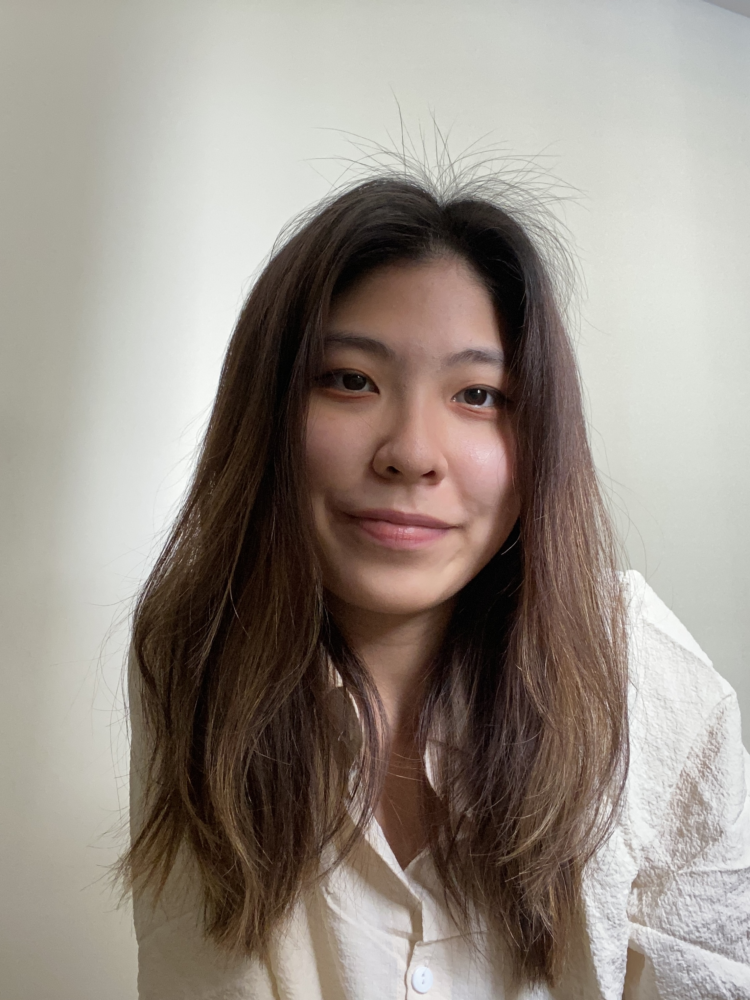

We are a team based in the [School of Computing, National University of Singapore](http://www.comp.nus.edu.sg).

You can reach us at the email:

Tan Jun Da - `jundatan@hotmail.com`

Darius Ng - `darius-ng@live.com`

Kalaris Ng - `kalarisng@u.nus.edu`

JiaHui Liao - `e0775484@nus.edu.sg`

## Project team

### Tan Jun Da

[[github](https://github.com/jundatan)]
[[portfolio](team/jundatan.md)]

* Role: Integration
* Responsibilities: Integration checking, scheduling and tracking, Dev OPs

### Darius Ng

[[github](http://github.com/dfordarius)]
[[portfolio](team/dfordarius.md)]

* Role: Documentation
* Responsibilities: Code quality, Dev ops, Documentation checking

### JiaHui Liao

[[github](https://github.com/oliviajhl)]
[[portfolio](team/oliviajhl.md)]

* Role: Tester and UI
* Responsibilities: Testing, Deals with UI, Dev Ops

### Kalaris Ng

[[github](http://github.com/kalarisng)]
[[portfolio](team/kalarisng.md)]

* Role: Team lead
* Responsibilities: Team lead, Deliverables and deadlines, Dev Ops

