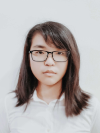
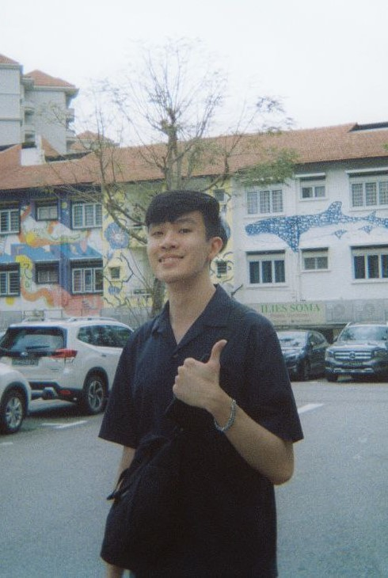
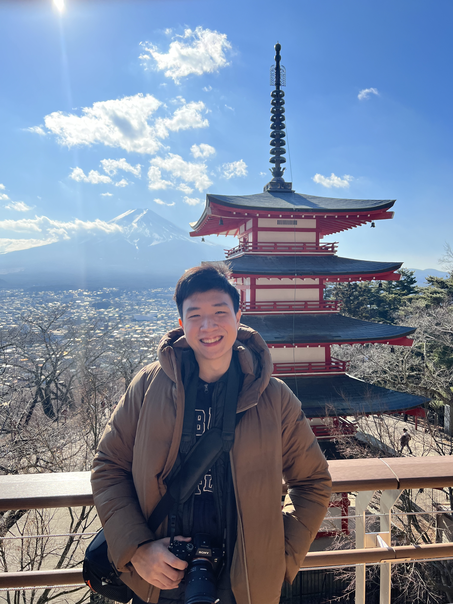
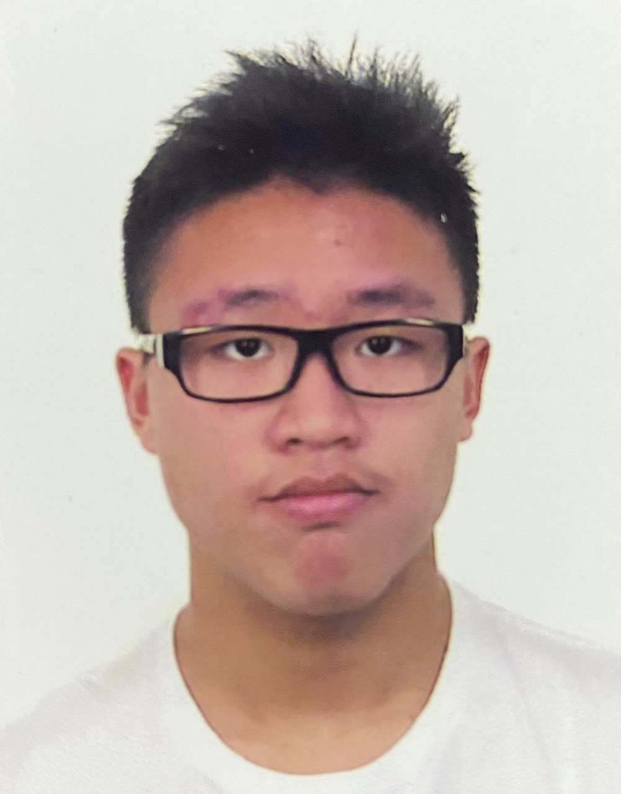

We are a team based in the [School of Computing, National University of Singapore](http://www.comp.nus.edu.sg).

You can reach us at the email `seer[at]comp.nus.edu.sg`

## Project team

### Shirshajit Sen Gupta

[[homepage](https://shirsho-12.github.io)]
[[github](https://github.com/shirsho-12)]
[[portfolio](team/gitsac.md)]

* Role: Manage the repository, implement features, perform testing
* Responsibilities: Project Management, Feature Implementation, Test Management

### Shi Wen Hong

[[github](http://github.com/jinbesan)]
[[portfolio](team/gitsac.md)]

* Role: Developer
* Responsibilities: Feature Implementation

### Randall Ng Hong Rong

[[github](http://github.com/randallnhr)] 
[[portfolio](team/randallnhr.md)]

* Role: Developer
* Responsibilities: Logic 

### Nicholas Lee Jun Yi

[[github](http://github.com/nicleejy)]

[[portfolio](team/nicleejy.md)]

* Role: Developer
* Responsibilities: UI

### Isaac Chai Han Jie

[[github](http://github.com/gitsac)]
[[portfolio](team/gitsac.md)]

* Role: Deliverables
* Responsibilities: Deliver deliverables

