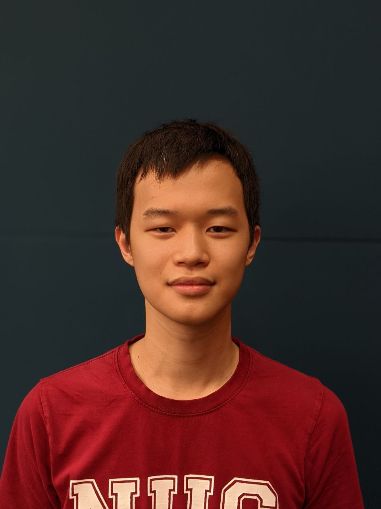
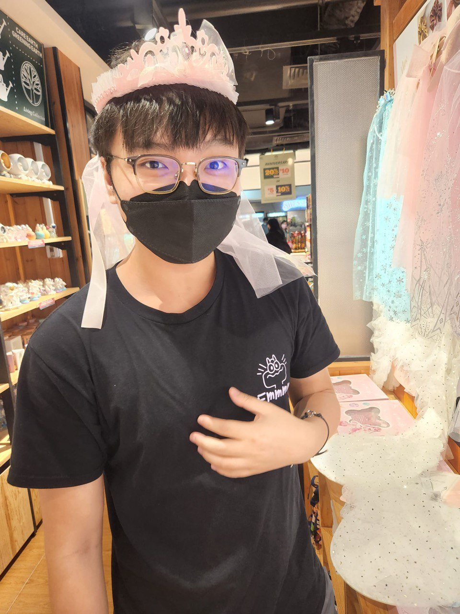
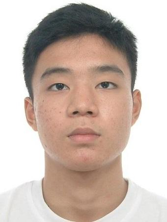

# About us
We are a team based in the [School of Computing, National University of Singapore](http://www.comp.nus.edu.sg).

You can reach us at the email `seer[at]comp.nus.edu.sg`

## Project team

### Joel Low

[[github](https://github.com/joellow88)]
[[portfolio](team/joellow88.md)]

* Role: Developer

### Haiqel

[[github](http://github.com/acerizm)]
[[portfolio](team/acerizm.md)]

* Role: Developer

### Gibson

[[github](http://github.com/Gibson0918)] [[portfolio](team/gibson0918.md)]

* Role: Developer

### Toh Wei Hao

[[github](http://github.com/Statspadders)]
[[portfolio](team/statspadders.md)]

* Role: Developer
* Responsibilities: Java

### Elvern Tan

[[github](http://github.com/elvern18)]
[[portfolio](team/elvern18.md)]

* Role: Developer

