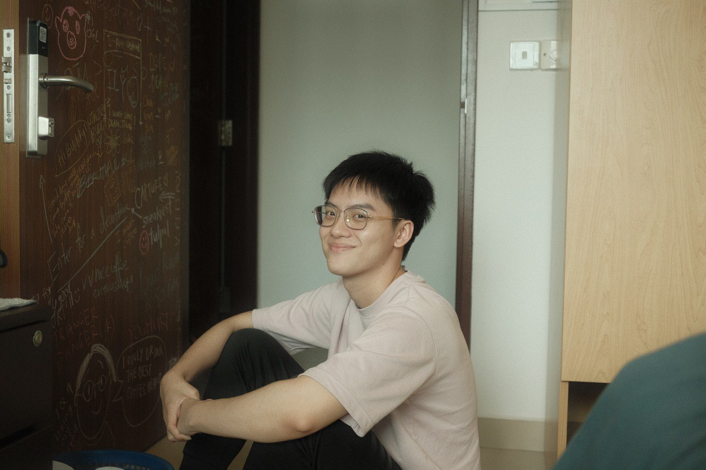
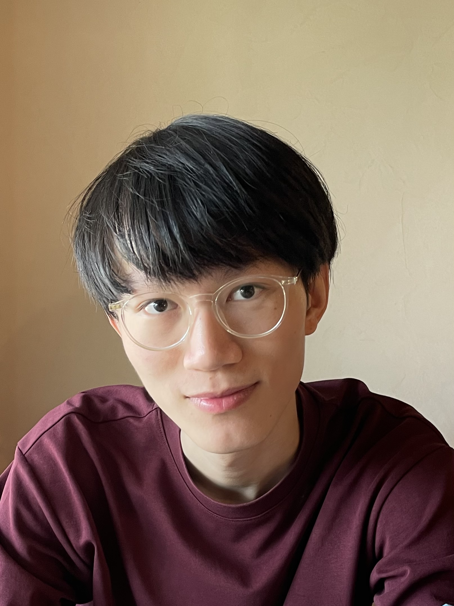

We are a team based in the [School of Computing, National University of Singapore](http://www.comp.nus.edu.sg).

You can reach us at the email `seer[at]comp.nus.edu.sg`

## Project team

### Pierce Ng Wei Sheng

[[github](https://github.com/igezt)]

* Role: Team lead
* Responsibilities: Model

### Stanley Han

[[github](http://github.com/hansstanley)]
[[portfolio](team/hansstanley.md)]

* Roles:
  * Integration
  * Scheduling and tracking
  * Git expert
* Responsibilities:
  * In charge of UI

### Nicholas Lim Jian Rong

[[github](http://github.com/johndoe)] [[portfolio](team/johndoe.md)]

* Role: Developer
* Responsibilities: Data

### Rachel Tan

[[github](http://github.com/johndoe)]
[[portfolio](team/johndoe.md)]

* Role: Developer
* Responsibilities: Dev Ops + Threading

### Shane Duggan

[[github](http://github.com/Shuggan)]

* Role: Documentation
* Responsibilities: Storage
