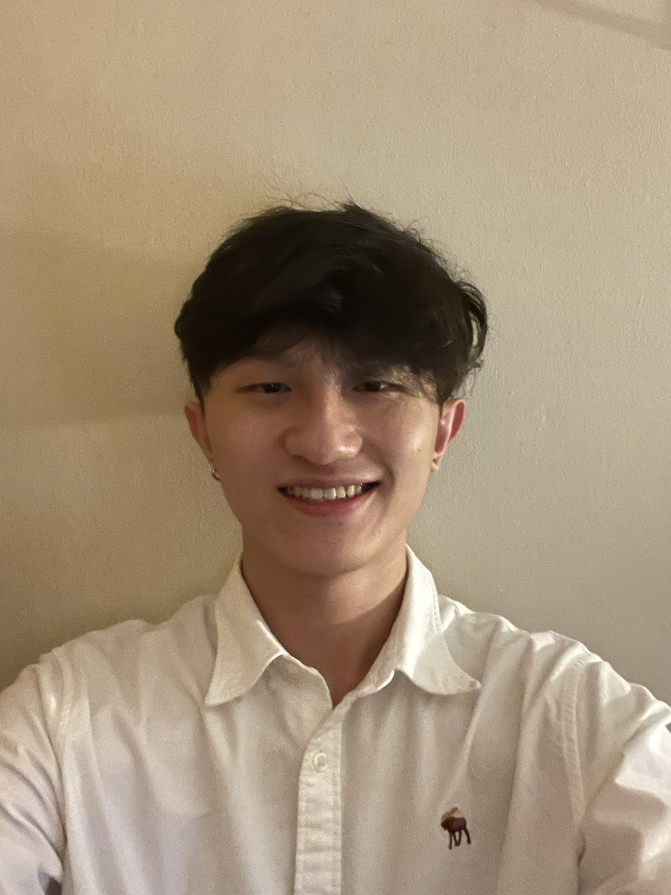
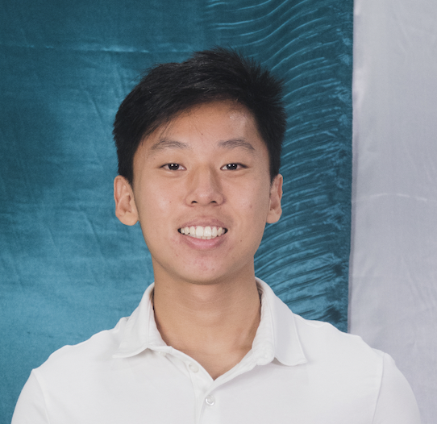
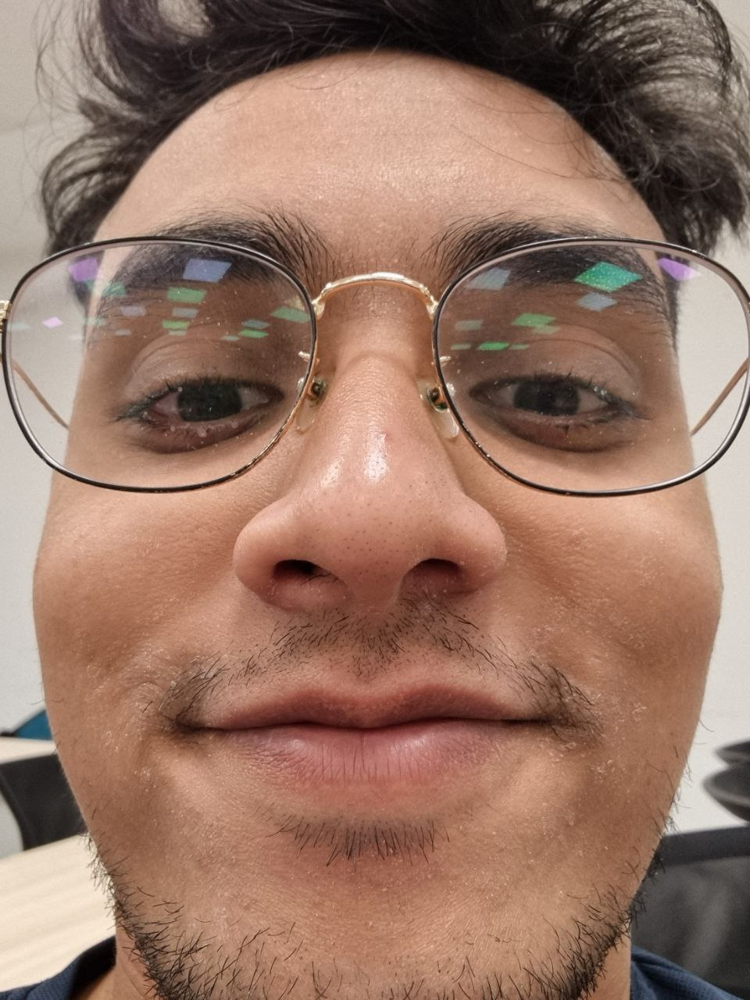

We are a team based in the [School of Computing, National University of Singapore](http://www.comp.nus.edu.sg).

You can reach us at the email `seer[at]comp.nus.edu.sg`

## Project team

### John Doe

[[homepage](http://www.comp.nus.edu.sg/~damithch)]
[[github](https://github.com/johndoe)]
[[portfolio](team/johndoe.md)]

* Role: Project Advisor

### Ang Yuze

[[github](http://github.com/yzmunchmunch)]
[[portfolio](team/yzmunchmunch.md)]

* Role: Team Lead
* Responsibilities: UI

### Pang Rui Wei

[[github](https://github.com/pangrwa)] 
[[portfolio](team/pangrwa.md)]

* Role: -To be Added soon- 
* Responsibilities: -To be Added soon- 

### Lu Chenyu

[[github](http://github.com/adam07018)]
[[portfolio](team/adam07018.md)]

* Role: Developer
* Responsibilities: Policy Management Features

### Anunaya Joshi

[[github](http://github.com/anunayajoshi)]
[[portfolio](team/anunayajoshi.md)]

* Role: Developer
* Responsibilities: UI
