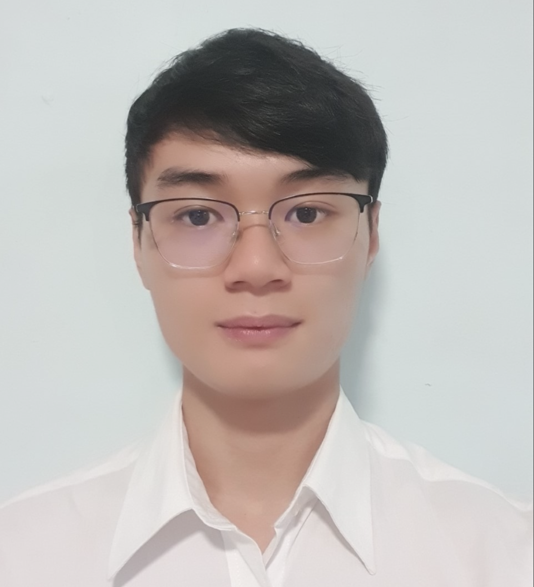
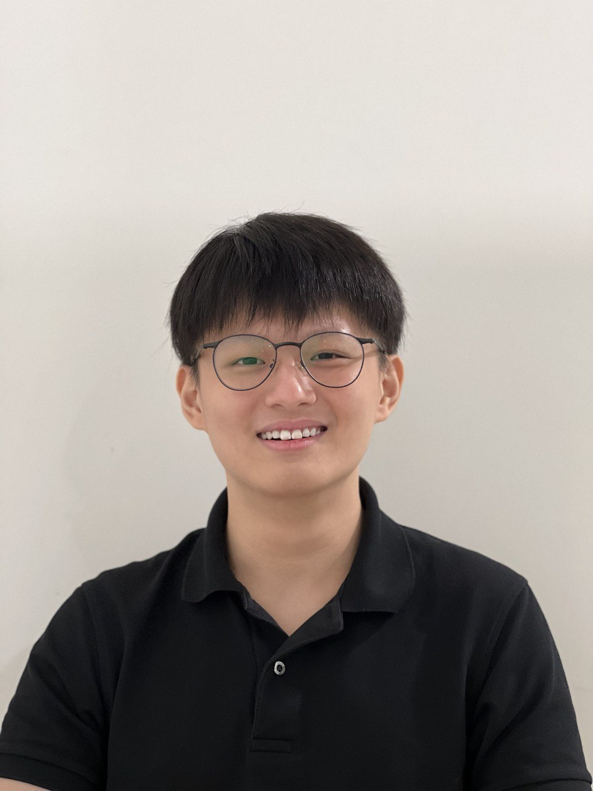

We are a team based in the [School of Computing, National University of Singapore](http://www.comp.nus.edu.sg).

## Project team

### Pang Chin Kiat, Vincent

[[github](https://github.com/securespider)]
[[portfolio](team/securespider.md)]

* Role: Developer
* Responsibilities: Scheduling and tracking

### Ma Yuanxin

[[github](https://github.com/mayuanxin1234)]
[[portfolio](team/mayuanxin1234.md)]

*  Role: Developer
*  Responsibilities: Deliverables and deadlines, and Integration

### Lim Diat Bhin

[[github](https://github.com/Diatbbin)]
[[portfolio](team/diatbbin.md)]

* Role: Developer
* Responsibilities: Code quality and Model component

### Yeo Wen Jue

[[github](https://github.com/MrTwit99)]
[[portfolio](team/mrtwit99.md)]

* Role: Developer
* Responsibilities: Testing
