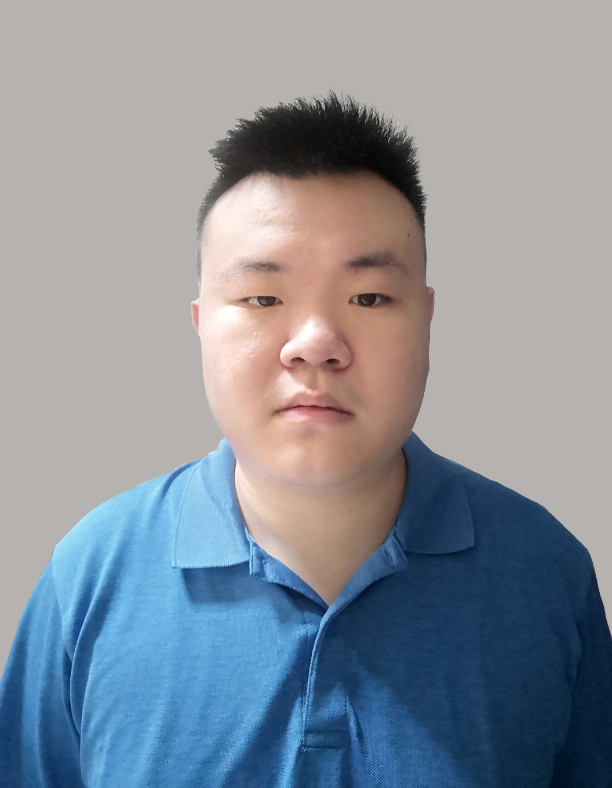
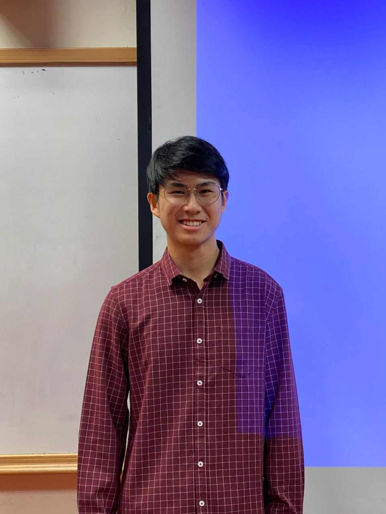

We are a team based in the [School of Computing, National University of Singapore](http://www.comp.nus.edu.sg).

You can reach us at the email `seer[at]comp.nus.edu.sg`

## Project team

### Liu Muchen

[[github](https://github.com/LiuMC-SG)]
[[portfolio](team/liumc-sg.md)]

* Role: Team Lead

### Darren Chang

[[github](http://github.com/ChangGittyHub)]
[[portfolio](team/changgittyhub.md)]

* Role: Software Developer
* Responsibilities: Scheduling and tracking   

### Arkar Kyaw Aung

[[github](https://github.com/arkarsg)]
[[portfolio](team/johndoe.md)]

* Role: Developer
* Responsibilities: Documentation & Testing

### Hmuu Myat Moe

[[github](https://github.com/HmuuMyatMoe)]
[[portfolio](team/johndoe.md)]

* Role: Developer
* Responsibilities: Documentation & Code Quality

### Chong Wei Guan

[[github](https://github.com/chongweiguan)]
[[portfolio](team/johndoe.md)]

* Role: Developer
* Responsibilities: Deliverables & Deadlines
