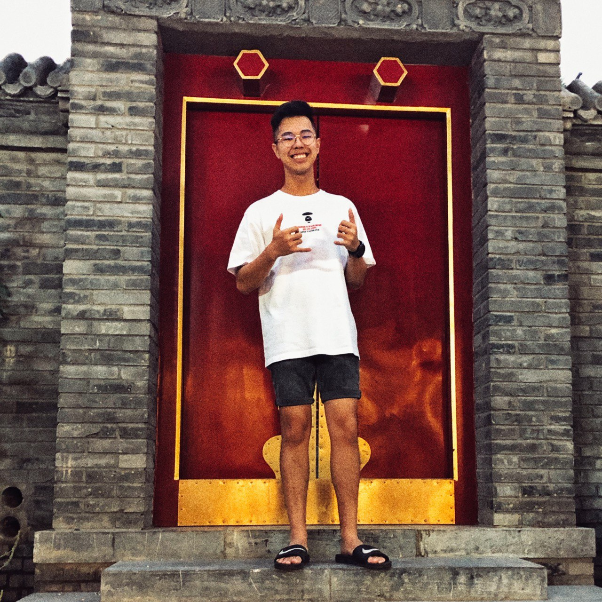
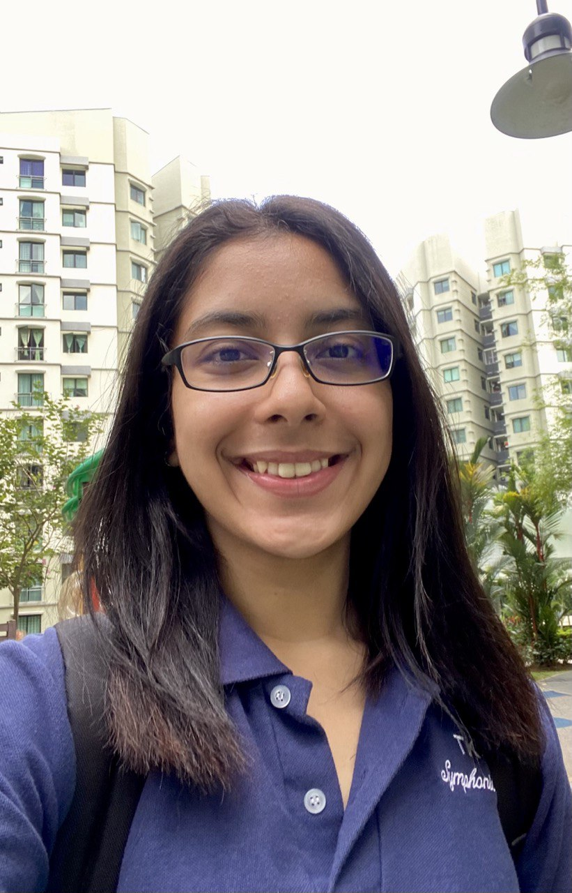
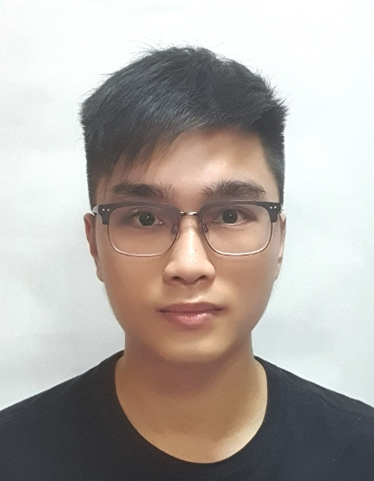
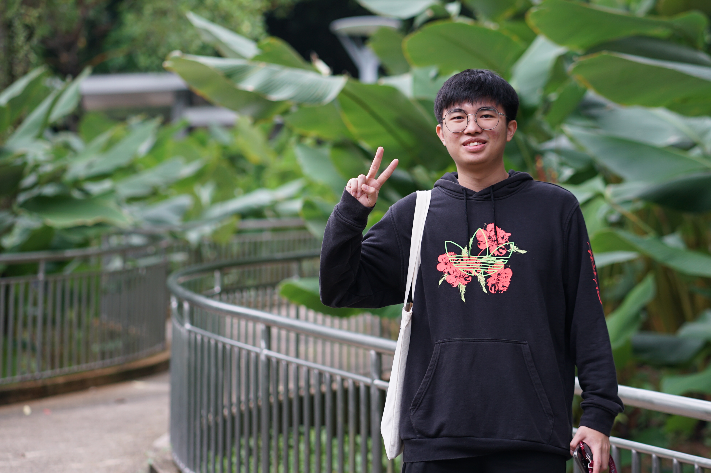
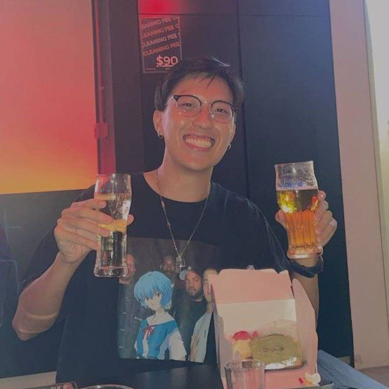

We are a team based in the [School of Computing, National University of Singapore](http://www.comp.nus.edu.sg)
aiming to transform fridge inventory management.   
You can reach us at the email `ng.jinyuan@u.nus.edu`

## Project team

### Ng Jin Yuan

[[github](http://github.com/jnjy)]
[[portfolio](team/jnjy.md)]

-   Role: Team lead, Git Expert
-   Responsibilities: Responsible for overall project coordination and assisting team with issues relating to Git.

### Ritika Joshi

[[github](https://github.com/rmj1405)]
[[portfolio](team/rmj1405.md)]

-   Role: Scheduling and tracking, Deliverables and deadlines
-   Responsibilities: Responsible for ensuring that requirements are being met. In charge of defining, assigning and tracking project tickets.

### Justin Leng

[[github](http://github.com/scorpiussigma)]
[[portfolio](team/scorpiussigma.md)]

-   Role: Integration
-   Responsibilities: Responsible for versioning of the code, maintaining the code repository, integrate various parts of the software to create a whole.

### Nigel Teo

[[github](http://github.com/nigelteosw)]
[[portfolio](team/nigelteosw.md)]

-   Role: UI/UX experts
-   Responsibilities: Responsible for the look of the product and user experience.

### Wesley Teo

[[github](http://github.com/bisceto)]
[[portfolio](team/bisceto.md)]

-   Role: Documentation
-   Responsibilities: Responsible for the quality of project documentation.
