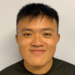

We are a team based in the [School of Computing, National University of Singapore](http://www.comp.nus.edu.sg).

## Project team

### Andre Lin

[[github](https://github.com/4ndrelim)]
[[portfolio](team/4ndrelim.md)]

- Role: Developer, PR Reviewer
- Responsibilities: Integration, Testing & Bug Fixing
- In-charge of: Employee class and related features

### Kenneth Kiang

[[github](https://github.com/kennethk-1201)]
[[portfolio](team/kennethk-1201.md)]

- Role: Team Lead

### Park Kwangjoo

[[github](http://github.com/johndoe)]
[[portfolio](team/pkwangjoo.md)]

- Role: Developer
- Responsibilities: Integration
- In-charge of: Performance review features

### Chee Jer En

[[github](http://github.com/jerrrren)]
[[portfolio](team/jerrrren.md)]

- Role: Code reviewer
- Responsibilities: Review Code

### Johnathan Wee

[[github](http://github.com/jweeyh)]
[[portfolio](team/jweeyh.md)]

- Role: Developer
- Responsibilities: Secretary
- In-charge of: Department features
