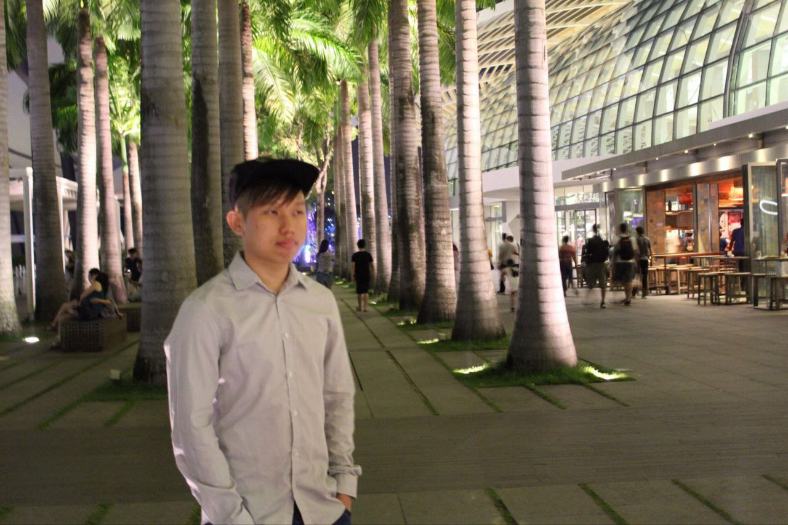
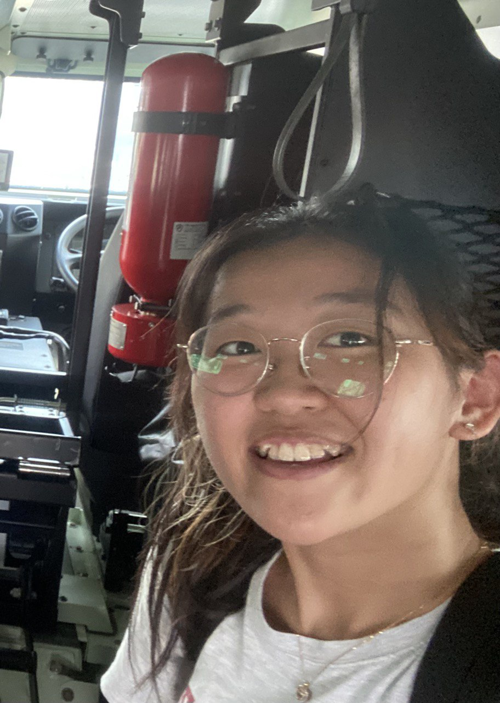
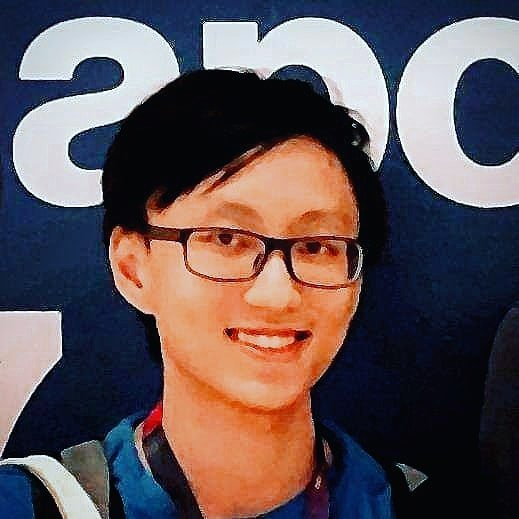

We are a team based in the [School of Computing, National University of Singapore](http://www.comp.nus.edu.sg).

You can reach us at the email `ay2223s2-cs2103-f10-2.zhzgv@aleeas.com`

## Project team

### Lee Shao Wee

[[homepage](https://leeshaowee.netlify.app/)]
[[github](https://github.com/shaowi)]
[[portfolio](team/shaowi.md)]

- Role: Developer
- Responsibilities: Deliverables, deadlines, scheduling and tracking

### Hing Zi Yang Benedict

[[github](http://github.com/hingen)]
[[portfolio](team/hingen.md)]

- Role: Developer
- Responsibilities: Code Quality + Integration

### Khang Tran

[[github](http://github.com/lennoxtr)]
[[portfolio](team/lennoxtr.md)]

- Role: Developer
- Responsibilities: File I/O

### Joy Tan QiaoTong

[[github](http://github.com/joytqt-1202)]
[[portfolio](team/joytqt-1202.md)]

- Role: Developer
- Responsibilities: Documentation + Testing

### Jedidiah Cheng

[[github](https://github.com/jedidiahC)]
[[portfolio](team/jedidiahc.md)]

- Role: Developer
- Responsibilities: UI
