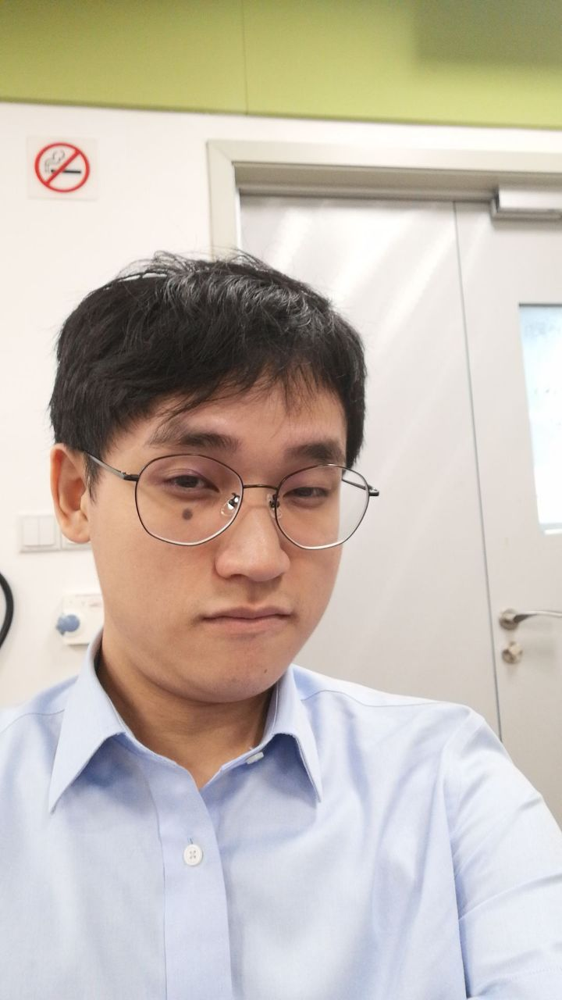
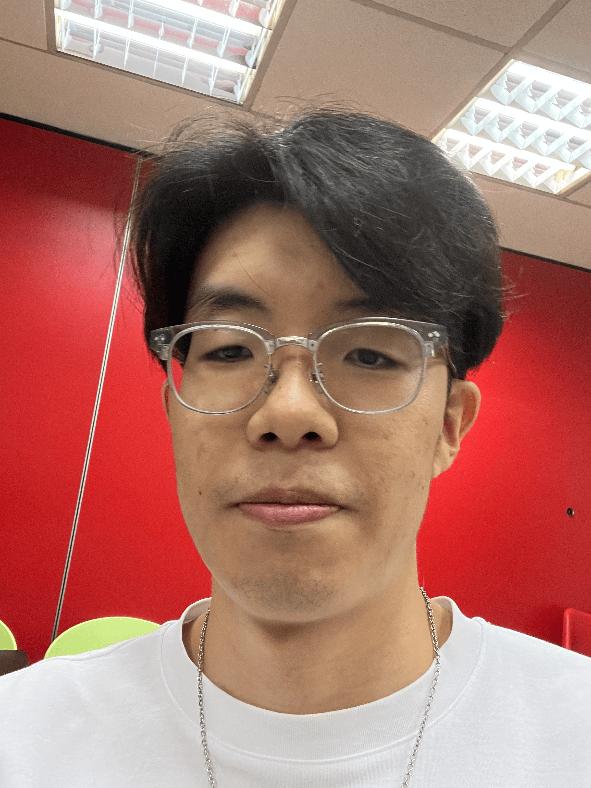
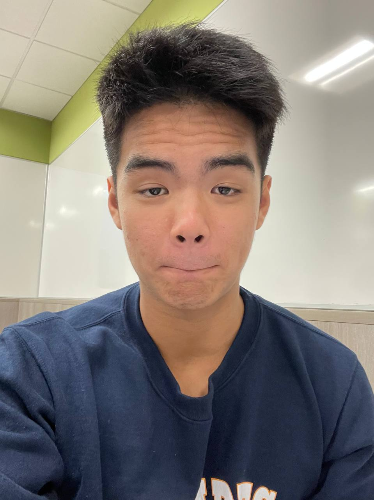
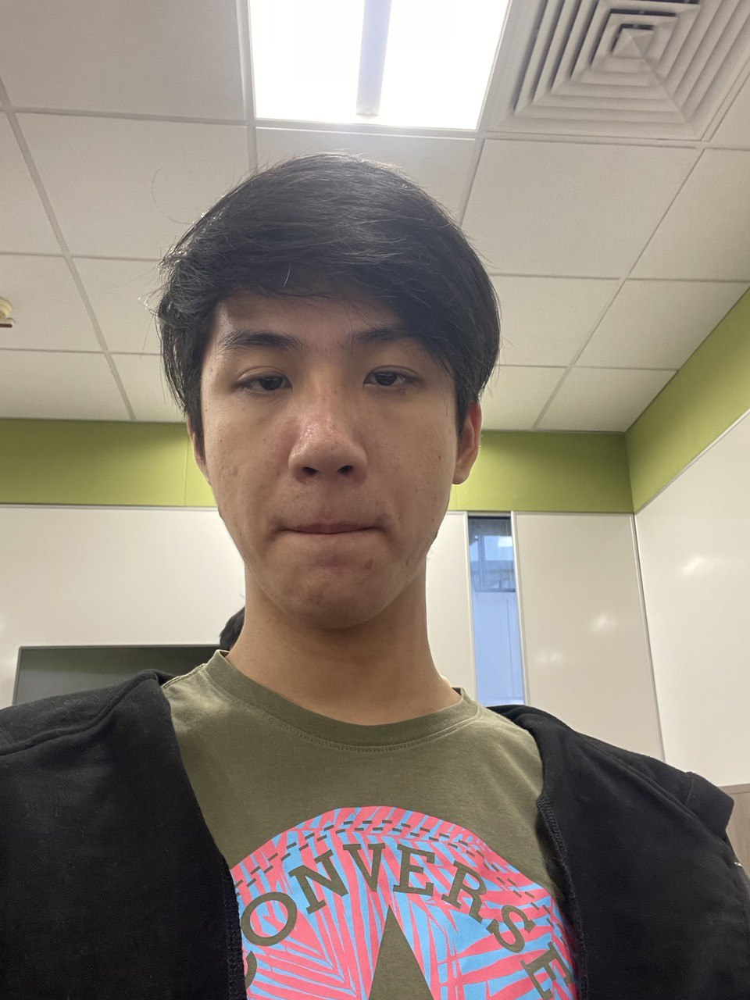
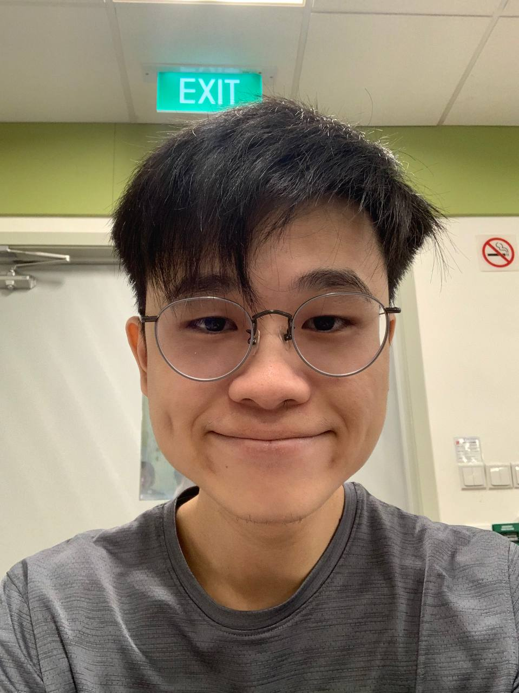

We are a team based in the [School of Computing, National University of Singapore](http://www.comp.nus.edu.sg).

You can reach us at the email `darrensim999@gmail.com`

## Project team

### Kevin Eyo Kai Wen

[[github](https://github.com/KevinEyo1)]
[[portfolio](team/kevineyo1.md)]

* Role: Team Lead/Developer
* Responsibilities: Scheduling and tracking

### Tan Yu Fei

[[github](https://github.com/Lanreath)]
[[portfolio](team/lanreath.md)]

* Role: Developer
* Responsibilities: Testing and developer guide

### Anton Timothy Lee Zi Jie

[[github](https://github.com/antonlee59)]
[[portfolio](team/antonlee59.md)]

* Role: Developer
* Responsibilities: Code quality and developer guide

### Alexander Lee Shao Bin

[[github](https://github.com/Varstak)]
[[portfolio](team/varstak.md)]

* Role: Developer
* Responsibilities: Deliverables and deadlines, user guide

### Darren Sim

[[github](https://github.com/BagDownB3nny)]
[[portfolio](team/bagdownb3nny.md)]

* Role: Developer
* Responsibilities: Integration
