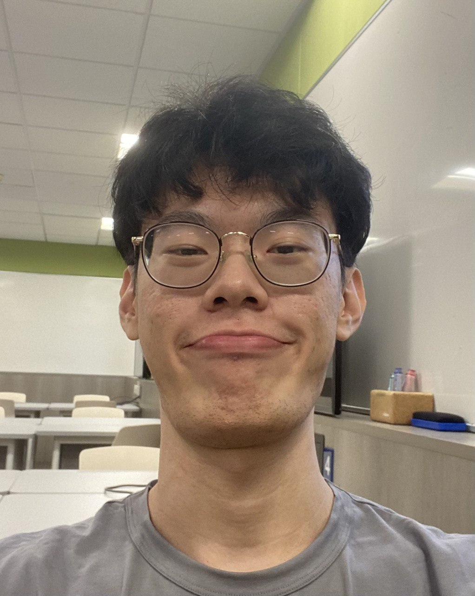
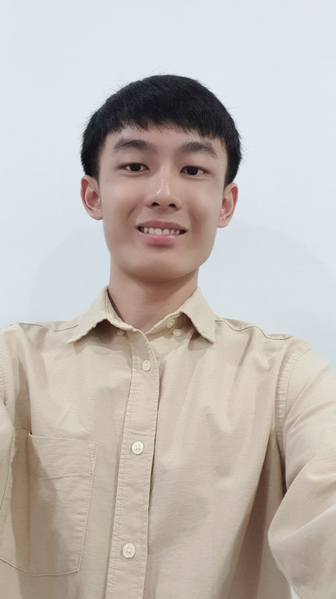
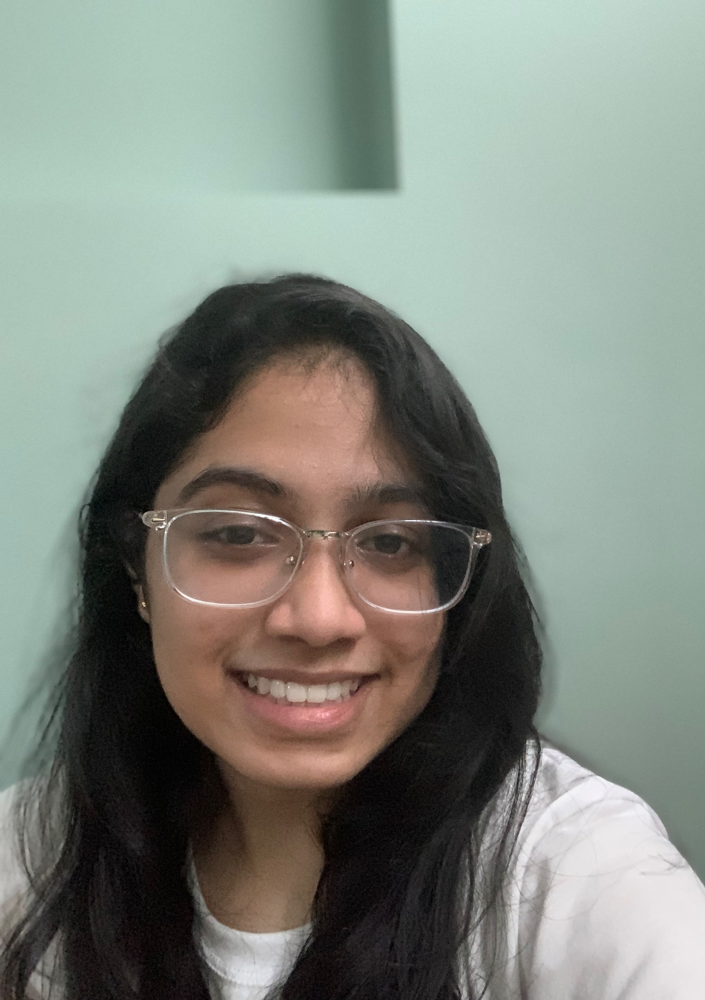
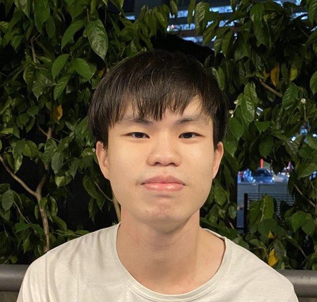
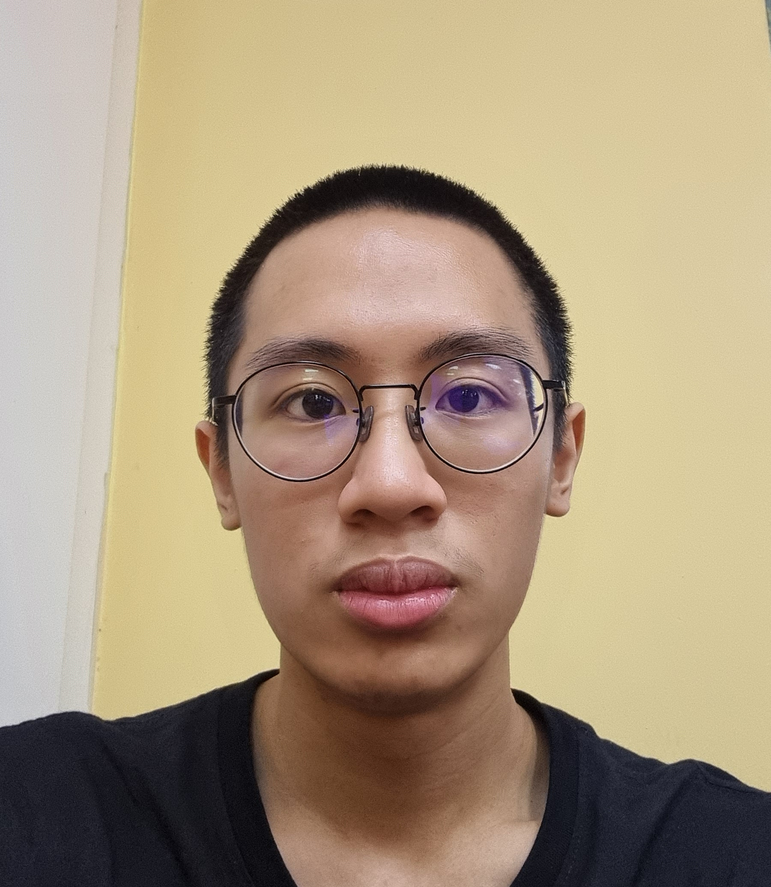

We are a team based in the [School of Computing, National University of Singapore](http://www.comp.nus.edu.sg).

## Project team

### Goh Kang Yang Eric

[[homepage](https://dangabit.github.io/)]
[[github](https://github.com/Dangabit)]
[[portfolio](team/dangabit.md)]

* Role: Team Lead / Developer
* Responsibilities: Models & Storage

### Goh Jun How

[[github](https://github.com/jun-how)]
[[portfolio](team/jun-how.md)]

* Role: Developer
* Responsibilities: Logic & Deliverables/Deadline

### Jyothika

[[github](http://github.com/cjyothika)] [[portfolio](team/cjyothika.md)]

* Role: Developer
* Responsibilities: Testing and CI

### James Tan

[[github](http://github.com/jmestxr)]
[[portfolio](team/jmestxr.md)]

* Role: Developer
* Responsibilities: Documentation, UI

### Cheam Jia Wei

[[github](https://github.com/Cheamybunny)]
[[portfolio](team/cheamybunny.md)]

* Role: Developer
* Responsibilities: Code Quality & Scheduling/Tracking
