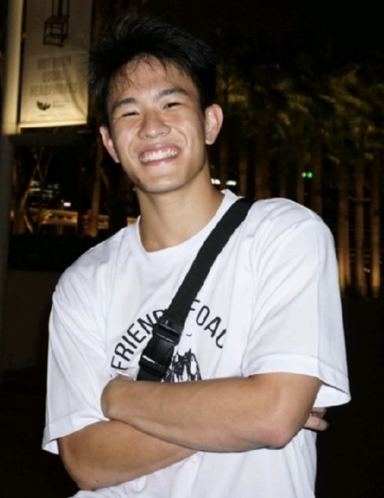
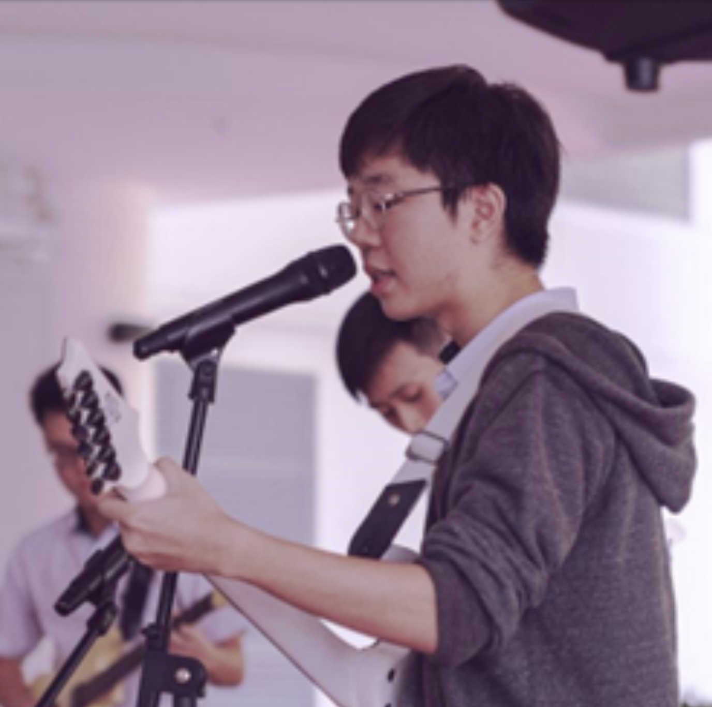
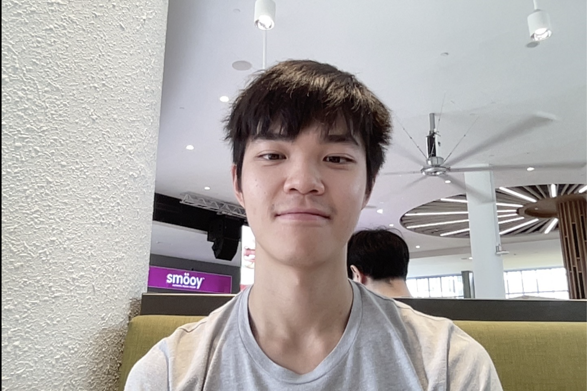
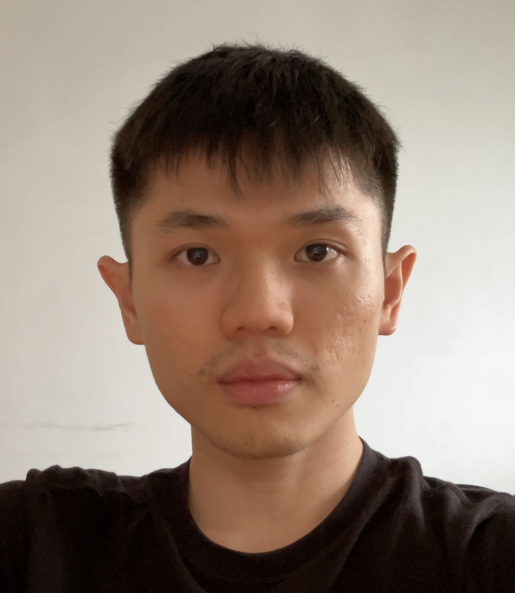

We are a team based in the [School of Computing, National University of Singapore](http://www.comp.nus.edu.sg).

You can reach us at the github `https://github.com/AY2223S2-CS2103T-F12-2`

## Project team

### An Cheng Yang

[[github](https://github.com/anchengyang)]
[[portfolio](team/anchengyang.md)]

* Role: Project Advisor
* Responsibilities: Data

### Nam Harin

[[github](https://github.com/harin0826)]
[[portfolio](team/harin0826.md)]

* Role: Team Lead
* Responsibilities: UI

### Darie Chan Rong Zhi

[[github](https://github.com/nappysprout)] [[portfolio](team/nappysprout.md)]

* Role: Developer
* Responsibilities: Data

### Tan Wei Shwin, Linus

[[github](https://github.com/linustws)]
[[portfolio](team/linustws.md)]

* Role: Developer
* Responsibilities: Dev Ops + Threading

### Yip-Au Hew Kit, Shawn

[[github](http://github.com/shawnyip-au)]
[[portfolio](team/shawnyip-au.md)]

* Role: Developer
* Responsibilities: UI
