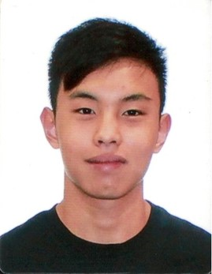
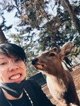
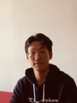

We are a team based in the [School of Computing, National University of Singapore](http://www.comp.nus.edu.sg).

You can reach us at the emails `e0725564@u.nus.edu`, `e0725569@u.nus.edu`, `e0860597@u.nus.edu`,` e0908339@u.nus.edu` or `e0701815@u.nus.edu`

## Project team

### Timothy

[[github](https://github.com/TimothyLawSongEn)]
[[portfolio](team/timothylawsongen.md)]

* Role: Project Advisor

### Bryan

[[github](http://github.com/bryanongjx)]
[[portfolio](team/bryanongjx.md)]

* Role: Team Lead
* Responsibilities: UI

### Ryan

[[github](http://github.com/ryanchua00)] [[portfolio](team/ryanchua00.md)]

* Role: Developer
* Responsibilities: Data

### Bo Kuan

[[github](http://github.com/bokuanT)]
[[portfolio](team/bokuant.md)]

* Role: Developer
* Responsibilities: Dev Ops + Threading

### Avery

[[github](http://github.com/Diamondroxxx)]
[[portfolio](team/diamondroxxx.md)]

* Role: Developer
* Responsibilities: UI
